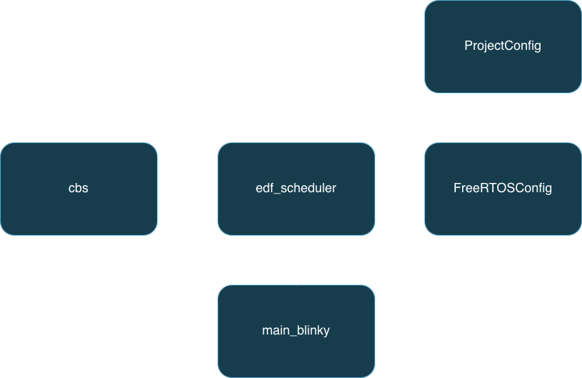
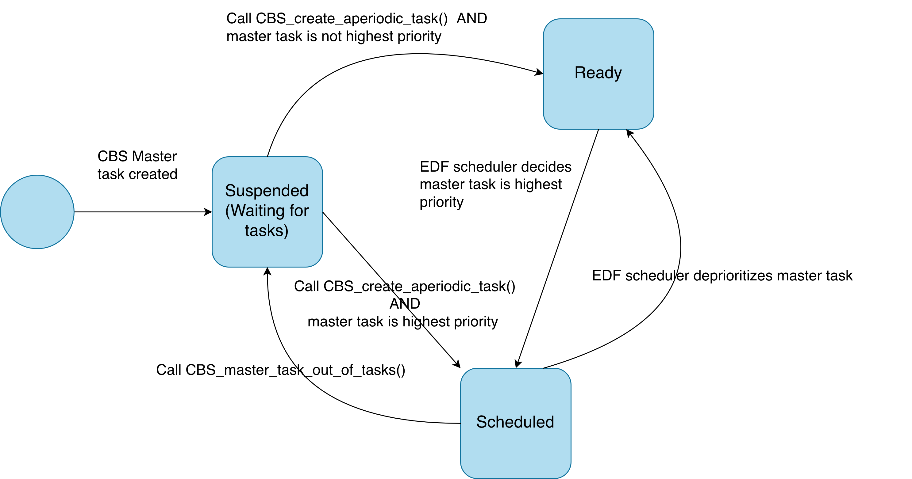

# CBS - Design

Our CBS implementation design description is divided into two parts. First, we provide a high-level system overview of our modules. Second, we dive deep into each individual component of our implementation, providing state diagrams showing how a CBS server undergoes changes in its state in response to key events, such as the budget running out and running out of tasks to run. 

## System Overview



*Figure 1.1 - System Overview* 

Like previous milestones, `main_blinky` is the main entrypoint to our application. `edf_scheduler` defines the function definition for the tick hook and public APIs for `cbs` are injected into this tick hook in a plug-and-play manner. `FreeRTOSConfig` sets up configurations such as tick frequency and FreeRTOS hooks and is imported into the kernel, whereas `ProjectConfig` defines application-level configuration constants, such as flags for toggling CBS on and off. `cbs` defines all logic necessary for initializing and scheduling tasks on constant-bandwidth servers, defining public APIs meant to be used by other modules (e.g., `edf`) and APIs meant to be used by the developer. 

The encapsulation of CBS specific logic in the `cbs` module and ability to plug-and-play CBS-specific logic into the tick hook in a manner easily toggled on and off using the CBS feature flag greatly decoupled `edf_scheduler` and `cbs`. Trivial changes were made in `edf_scheduler` to accomodate CBS, minimal changes were made to the data structures defining tasks, and `edf_scheduler` remained unaware of any special type of "CBS" task (it continued to only define two types of tasks - aperiodic tasks and periodic tasks). This design choice paid off tremendously when regression testing: all regression tests for EDF and SRP passed without needing to change the logic implemented in previous milestones (only changes in data piping based on minor signature changes needed to be implemented). 

All of these modules are defined as a wrapper layer on top of the FreeRTOS API. Design decisions and tradeoffs discussing this choice are detailed in the documentation for "EDF". 
## Server Instantiation 

Users call `CBS_create_cbs_server` with a maximum budget, period, and ID to instantiate a server. This creates a special type of aperiodic task (a "CBS master task") that acts like a CBS server. Additionally, this instantiates server-associated metadata called `CBS_MB` ("CBS Metadata Block"). `CBS_MB` holds the deadline, budget, maximum budget, period, queue of soft real-time aperiodic tasks, and importantly, a handle to the `TMB`, "Task Metadata Block", (see "EDF" documentation for details) corresponding to the CBS metadata block. This allows the `cbs` module to easily update task-specific metadata such as deadlines and influence the decision-making of the EDF scheduler without the EDF scheduler being aware of CBS logic. 

```
typedef struct {
  TickType_t          dsk;
  TickType_t          Qs;
  TickType_t          Ts;
  TickType_t          cs; // budget
  Queue_t             aperiodic_tasks;
  AperiodicTaskFunc_t aperiodic_tasks_storage[CBS_QUEUE_CAPACITY];
  TMB_t              *tmb_handle;
} CBS_MB_t;
```
*Figure 1.2 - Snapshot of CBS_MB*
## Aperiodic Task Scheduling

Users call `CBS_create_aperiodic_task` to schedule an aperiodic task (a function pointer) onto a CBS server of their choice. This function accepts a release time as a parameter - allowing for aperiodic tasks to be precisely dropped into the system while the system is running. 
## Aperiodic Task Representation 

A soft real-time aperiodic task is represented as the following type. 

`typedef BaseType_t (*AperiodicTaskFunc_t)(void);`

We allow tasks to return a value. This means error codes could be introduced into the CBS Server with minor modifications.

We currently do not support passing parameters to soft real-time aperiodic tasks. The major reason for this was that this wasn't a core requirement for writing the test cases and essential functionality for this milestone. Our focus in our design was simplicity and correctness. However, should parameters ever be an essential functionality, this new feature can be easily accomodated by maintaining a queue of tuples $(\text{fnptr}, \text{parameters})$ in the CBS server queue instead of a queue of function pointers. 

Despite these tradeoffs, our simple aperiodic task representation offers multiple benefits. By not having the CBS master task manage other FreeRTOS tasks, but instead manage "tasks" represented simply as function pointers, we avoid having to make additional calls to the FreeRTOS API to manage, suspend, and resume individual FreeRTOS tasks. Stack space management also becomes easier - when our master task calls a soft real-time aperiodic task, any stack space needed for this function is simply allocated on the master tasks's stack space. No complex management of assigning and reassigning stack space between FreeRTOS tasks needs to happen. Thus, our implementation provides simplicity, correctness, and ease of extensibility. 

## Interface with EDF Scheduler

The interface of CBS with other modules is incredibly lightweight and simple. CBS functionality is toggled on and off using 5 lines of code inserted in the tick hook: 
```
...
#if USE_CBS
  CBS_release_tasks();
  TaskHandle_t current_task_handle = xTaskGetCurrentTaskHandle();
  TMB_t       *current_task        = EDF_get_task_by_handle(current_task_handle);
  // INVARIANT: current_task was the task that ran for the last tick
  CBS_update_budget(current_task);
#endif // USE_CBS
...
```

`CBS_release_tasks` is responsible for releasing soft real-time aperiodic tasks to their respective CBS servers at the appropriate release times. It accomplishes this by iterating over an array of metadata blocks containing the aperiodic task's function pointer, its release time, and destination CBS server ID. if a specific soft real-time aperiodic task can be released, its function pointer is enqueued on the queue of its corresponding CBS server. 

Meanwhile, `CBS_update_budget` takes in the current task. If this current task corresponds to a CBS master task, it updates the budget of the corresponding CBS server. If the budget runs out, the master task's deadline is updated and its budget is replenished. 

The ability to insert CBS book-keeping functionality into our tick handler in only a few lines of code in a plug-and-play fashion decouples our `cbs` and `edf_scheduler` implementations and maintains extensibility in our codebase. 

## Constant-Bandwidth Server State Transitions 



*Figure 1.3 - State Diagram of Constant Bandwidth Server*

Figure 1.3 demonstrates how different API calls and events cause the CBS master task to alternate between different states. 

The creation of an aperiodic task via `CBS_create_aperiodic_task()` "wakes up" the CBS server if it previously had no tasks in its queue. After that, the CBS master task is simply scheduled like a regular EDF task - with its deadline deciding its priority. 

When the CBS server runs out of tasks, it calls `CBS_master_task_out_of_tasks()` causing a self-suspension. Meanwhile, if the CBS server depletes its budget, its deadline may be postponed, potentially causing the master task to be deprioritized by the EDF scheduler. 

The usage of explicit API calls to signal task creation and running out of tasks keeps the transitions between different states of our CBS server *event-driven*, introducing determinism and reducing the risk of bugs from race conditions. 
