# CBS - Testing

## Overview

The hardware-in-the-loop (HIL) testing framework described in the SRP documentation was used and extended for CBS testing to generate reliable plots depicting the traces of CBS tests.

Simple simulations of CBS tasks were ascertained by hand. The RTSIM simulator (http://rtsim.sssup.it/) was employed to generate traces for complex simulations that would have been time-consuming to ascertain by hand. These traces were then read and plotted using a custom Python script. Any discrepancies between the plots generated using RTSIM and our CBS simulator were further investigated.

The RTSIM simulator was developed by the ReTIS Lab - the same lab where the CBS algorithm originated. By using a real-time simulator supporting CBS, complex test cases involving interactions between multiple periodic tasks and CBS servers of varying bandwidth could be efficiently tested. The directory `RTSIM/` (https://github.com/jeromecho/CPSC-538G---FreeRTOS-Projects/tree/4-smp/RTSIM) contains both the `.cpp` files used to write simulations, the traces generated using RTSIM, and the python script for plotting.

The notation Si below represents the ith CBS server. When Si is used as a column header in a table, it represents the number of the CBS server an aperiodic task was assigned to. To distinguish between hard real-time periodic tasks and soft real-time aperiodic tasks, the notation pi refers to periodic tasks and ai refers to aperiodic tasks. All units in the below tables are in milliseconds.

Our CBS implementation accepts tasks as the system is running. **Test 6** is one test of many demonstrating this.

Our tests demonstrate full branch testing of CBS. We clearly show which tests demonstrate which specific sections of the CBS algorithm. See the color-coded descriptions below.

- **Test 1** demonstrates both the **Yellow** and **Green** sections of the CBS algorithm. We see the deadline of the aperiodic task when it is released at tick 4 is set to 11 in _Image 1.2_ , demonstrating **"Yellow"**, since $r_j + (c / Q_s) * T_S = 3 + (3/3)*8 = 11 \geq 0 = d_{s,0}$ . Furthermore, _Image 1.3_ and _Image 1.4_ demonstrate "**Green**". _Image 1.4_ shows that the deadline of the first aperiodic task that was serviced by the CBS server was 19 when it finished. At tick 13, the second aperiodic task arrives at the CBS server. $r_j + (c/Q_s)*T_s = 13 + (2/3)*8 = 18.33 < 19 = d_{s,2}$. Thus, as expected, the task that arrives is assigned a deadline of 19 and the server deadline doesn't change.
- **Tests 2** and **3** demonstrate **Light Blue**. Test 2 shows that if a job finishes, it is correctly dequeued from the server and the server does not execute if it doesn't have any jobs. Test 3 shows that if there are jobs remaining in the queue, those jobs will be served.
- **Test 1** demonstrates **Blue**. _image 1.1_ shows the budget running out at tick 7. This makes sense since the first aperiodic task is released at tick 4 and the maximum budget of the server is 3. This shows correct book-keeping of the budget.
- **Test 1** demonstrate **Dark Blue**. As noted above, the budget ran out at tick 7. As mentioned above, $d_{s,0} = 0$ . So, $d_{s,1} = d_{s,0} + T_s = 11 + 8 = 19$, which is clearly seen in _image 1.1_, by reading the "Deadline" from the pop-up. Additionally, the budget is replenished to its maximum budget. This is made evident by the marking of a budget exhausted event (hourglass icon) at tick 15, which is correct since at tick 15, the server would have run for exactly 3 ticks since its last budget refill.

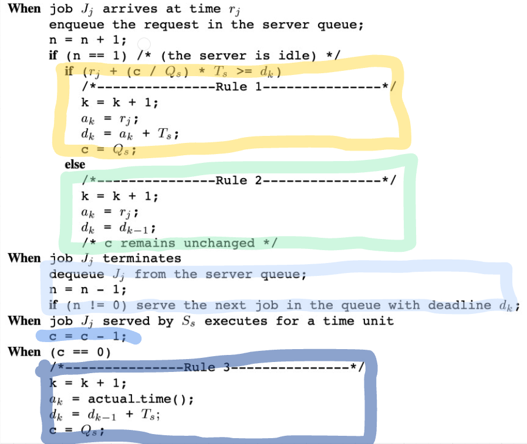

## Test 1 - Smoke Test (1 CBS Server, 1 Periodic Task)

This test was pulled from the course textbook (pg.190). It serves as a smoke test ascertaining core functionality of a CBS server.

_CBS Servers_

|    Server     | Qs | Ts |
| :-----------: | :-----------: | :-----------: |
| S1 |       3       |       8       |

_Hard Real-Time Periodic Tasks_

|     Task      | Ci | ri | Di | Ti |
| :-----------: | :-----------: | :-----------: | :-----------: | :-----------: |
| p1 |       4       |       0       |       7       |       7       |

_Soft Real-Time Aperiodic Tasks_

|     Task      | Ci | ri | Si |
| :-----------: | :-----------: | :-----------: | :-----------: |
| a1 |       4       |       3       |       1       |
| a2 |       3       |      13       |       1       |

**Expected**

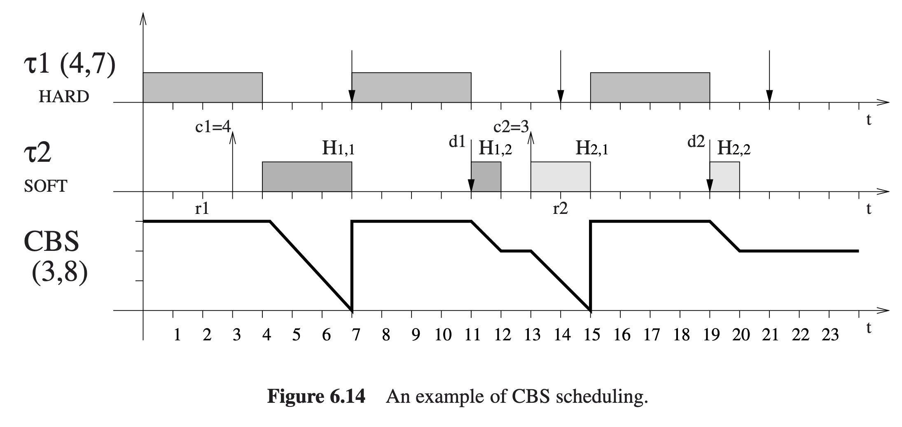
_source: course textbook (pg. 190)_

**Actual**

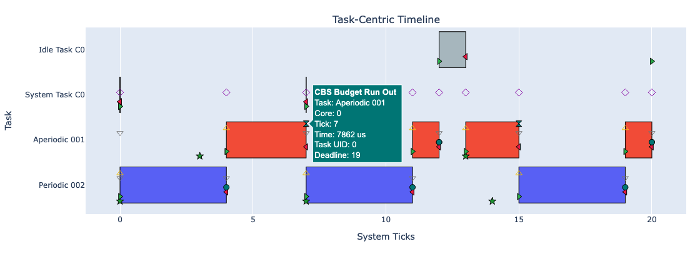
_Image 1.1_

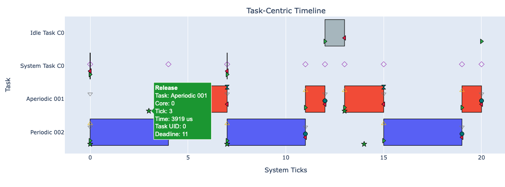
_Image 1.2_

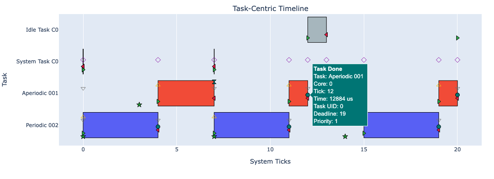
_Image 1.3_

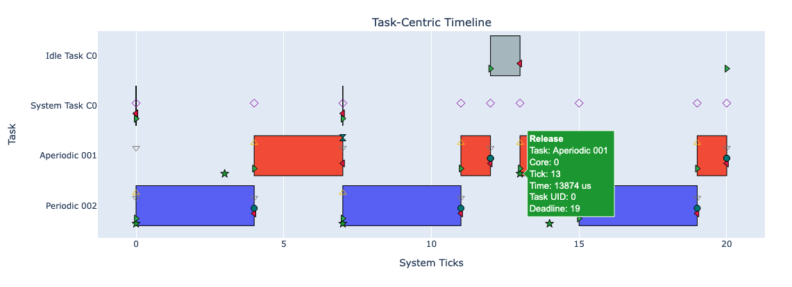
_Image 1.4_

## Test 2 - Single Aperiodic Task running on CBS Server

This test ascertains that the CBS task can run by itself.

_CBS Servers_

|    Server     | Qs | Ts |
| :-----------: | :-----------: | :-----------: |
| S1 |       3       |       8       |

_Soft Real-Time Aperiodic Tasks_

|     Task      | Ci | ri | Si |
| :-----------: | :-----------: | :-----------: | :-----------: |
| a1 |       4       |       0       |       1       |

**Expected**

We expect the aperiodic task (CBS server) to run for 4 ticks to service its one aperiodic task. This correctly happens.

**Actual**

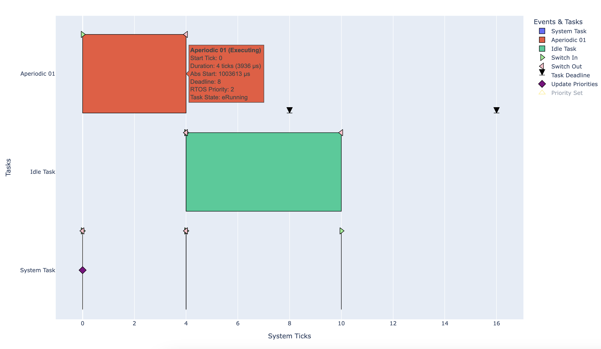

## Test 3 - Multiple Tasks Queueing up to Max Capacity on 1 CBS Server

This test ascertains that the CBS server can queue up tasks to its maximum capacity.

_CBS Servers_

|    Server     | Qs | Ts |
| :-----------: | :-----------: | :-----------: |
| S1 |       3       |       8       |

_Soft Real-Time Aperiodic Tasks_

|      Task      | Ci | ri | Si |
| :------------: | :-----------: | :-----------: | :-----------: |
| a1  |       4       |       0       |       1       |
| a2  |       4       |       0       |       1       |
| a3  |       4       |       0       |       1       |
| a4  |       4       |       0       |       1       |
| a5  |       4       |       0       |       1       |
| a6  |       4       |       0       |       1       |
| a7  |       4       |       0       |       1       |
| a8  |       4       |       0       |       1       |
| a9  |       4       |       0       |       1       |
| a10 |       4       |       0       |       1       |

**Expected**

We expect the aperiodic task (CBS server) to run for 4 x 10 = 40 ticks to service all of the tasks put inside of its queue (`CBS_QUEUE_CAPACITY = 10` was set for this test). This correctly happens.

**Actual**

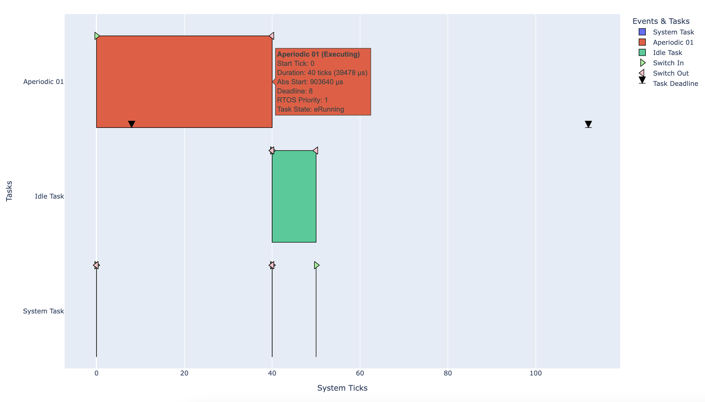

## Test 4 - Smoke Test - 1 CBS Server, 1 Periodic Task (but different setup from Test 1)

This test provides another smoke test of the CBS server co-existing with a periodic task.

_CBS Servers_

|    Server     | Qs | Ts |
| :-----------: | :-----------: | :-----------: |
| S1 |       2       |      10       |

_Hard Real-Time Periodic Tasks_

|     Task      | Ci | ri | Di | Ti |
| :-----------: | :-----------: | :-----------: | :-----------: | :-----------: |
| p1 |       2       |       0       |       4       |       5       |

_Soft Real-Time Aperiodic Tasks_

|     Task      | Ci | ri | Si |
| :-----------: | :-----------: | :-----------: | :-----------: |
| a1 |       3       |       0       |       1       |
| a2 |       4       |       0       |       1       |
| a3 |       3       |       0       |       1       |
| a4 |       4       |       0       |       1       |

**Expected**

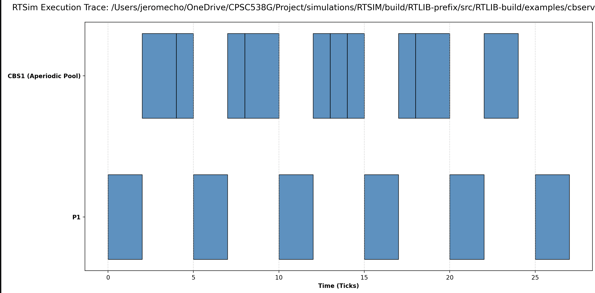

**Actual**

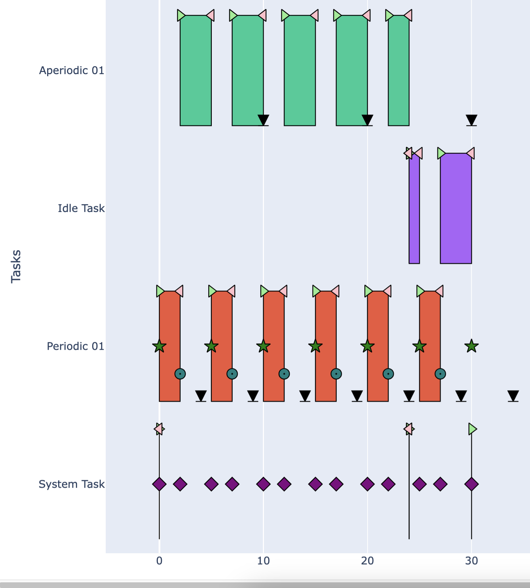

## Test 5 - Multiple Periodic Tasks Running Alongside Single CBS Server

This test ascertains that multiple periodic tasks can run alongside a single CBS server.

_CBS Servers_

|    Server     | Qs | Ts |
| :-----------: | :-----------: | :-----------: |
| S1 |       1       |      10       |

_Hard Real-Time Periodic Tasks_

|     Task      | Ci | ri | Di | Ti |
| :-----------: | :-----------: | :-----------: | :-----------: | :-----------: |
| p1 |       2       |       0       |       4       |       4       |
| p2 |       3       |       0       |       8       |       8       |

_Soft Real-Time Aperiodic Tasks_

|     Task      | Ci | ri | Si |
| :-----------: | :-----------: | :-----------: | :-----------: |
| a1 |       3       |       0       |       1       |
| a2 |       4       |       0       |       1       |
| a3 |       3       |       0       |       1       |
| a4 |       4       |       0       |       1       |

**Expected**

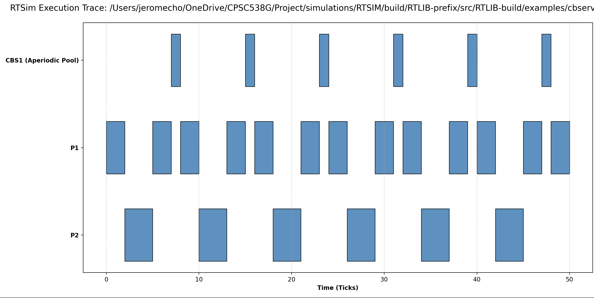

**Actual**

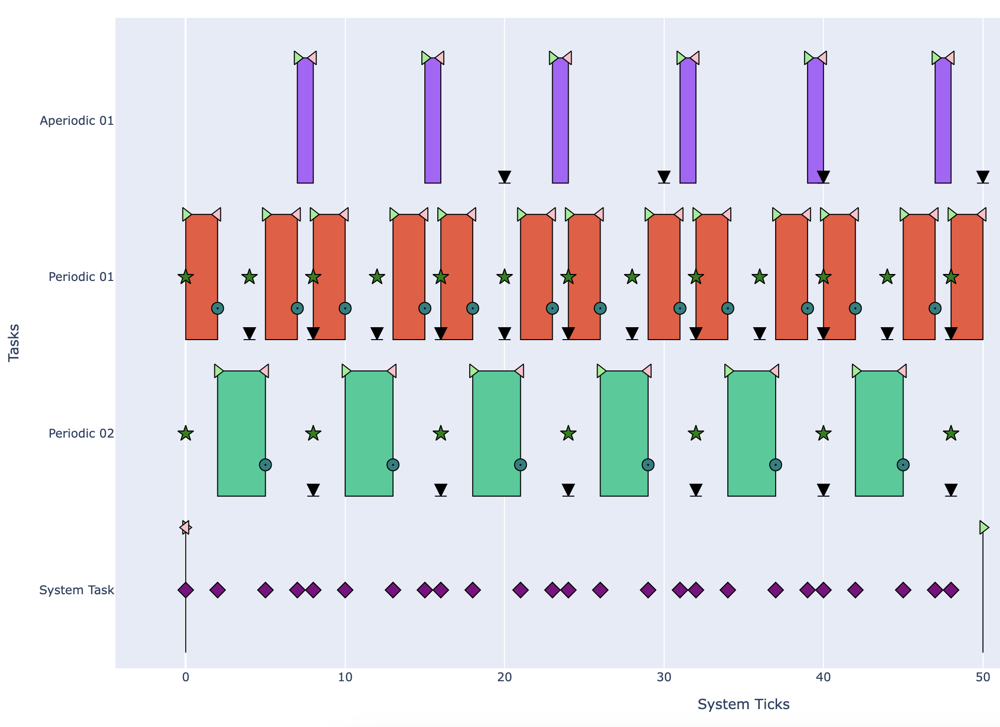

## Test 6 - Multiple Periodic Tasks Running Alongside 2 symmetric CBS servers

This test ascertains the ability for multiple periodic tasks to run alongside multiple CBS servers (each with the same maximum budget and period). This test along with multiple other tests below also demonstrate the ability of the CBS server in accepting aperiodic tasks while the system is running (with several aperiodic tasks having release times greater than 0).

_CBS Servers_

|    Server     | Qs | Ts |
| :-----------: | :-----------: | :-----------: |
| S1 |       1       |       8       |
| S2 |       1       |       8       |

_Hard Real-Time Periodic Tasks_

|     Task      | Ci | ri | Di | Ti |
| :-----------: | :-----------: | :-----------: | :-----------: | :-----------: |
| p1 |       2       |       0       |       6       |       6       |
| p2 |       1       |       0       |       3       |       3       |

_Soft Real-Time Aperiodic Tasks_

|     Task      | Ci | ri | Si |
| :-----------: | :-----------: | :-----------: | :-----------: |
| a1 |       3       |       0       |       1       |
| a2 |       3       |       0       |       2       |
| a3 |       4       |      20       |       1       |
| a4 |       4       |      20       |       2       |
| a5 |       1       |      40       |       1       |
| a6 |       2       |      40       |       2       |

**Expected**

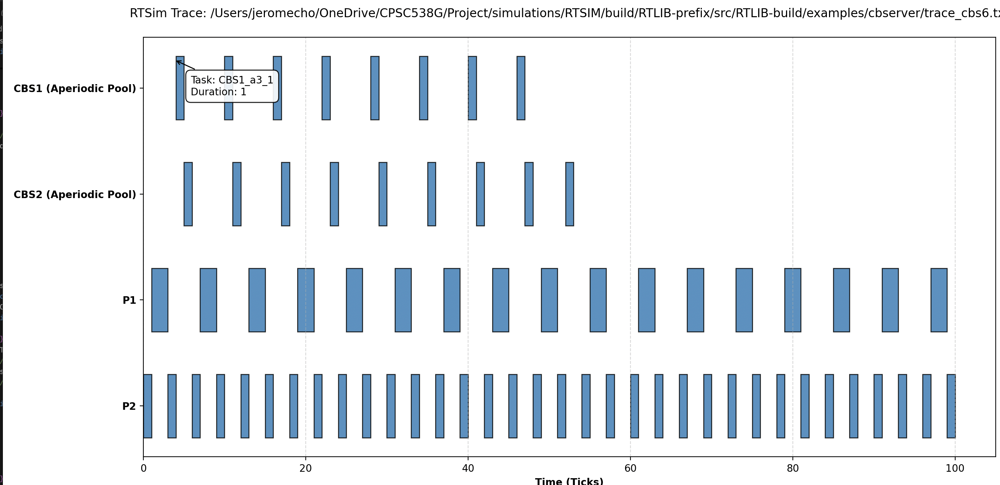

**Actual**

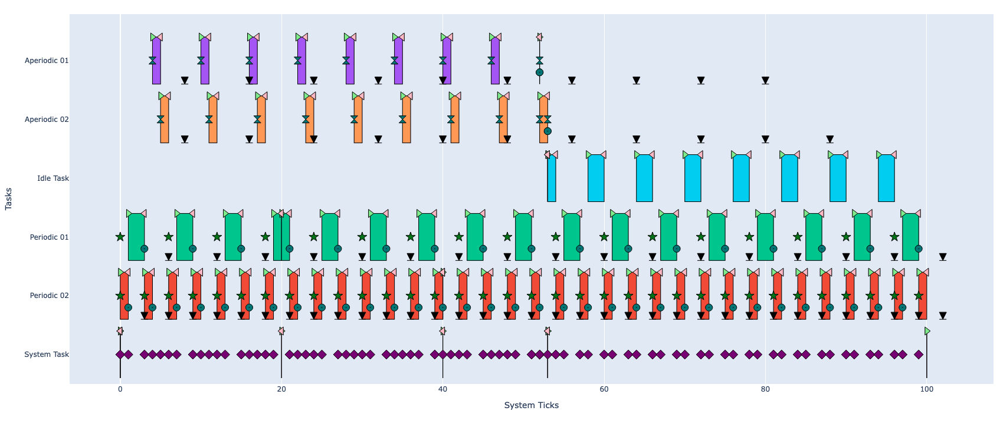

## Test 7 - Multiple Periodic Tasks Running Alongside 2 asymmetric CBS servers

This test ascertains the ability for multiple periodic tasks to run alongside multiple CBS servers (each with the different maximum budget and period configurations)

_CBS Servers_

|    Server     | Qs | Ts |
| :-----------: | :-----------: | :-----------: |
| S1 |       2       |      16       |
| S2 |       4       |      20       |

_Hard Real-Time Periodic Tasks_

|     Task      | Ci | ri | Di | Ti |
| :-----------: | :-----------: | :-----------: | :-----------: | :-----------: |
| p1 |       4       |       0       |      12       |      12       |
| p2 |       3       |       0       |       9       |       9       |

_Soft Real-Time Aperiodic Tasks_

|     Task      | Ci | ri | Si |
| :-----------: | :-----------: | :-----------: | :-----------: |
| a1 |       3       |       0       |       1       |
| a2 |       3       |       0       |       2       |
| a3 |       4       |      20       |       1       |
| a4 |       4       |      20       |       2       |
| a5 |       1       |      40       |       1       |
| a6 |       2       |      40       |       2       |

**Expected**

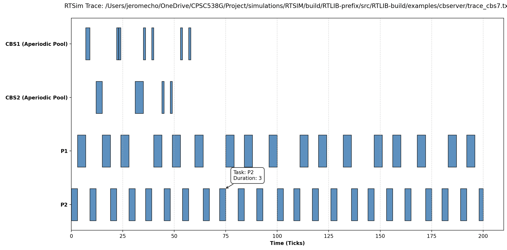

**Actual**

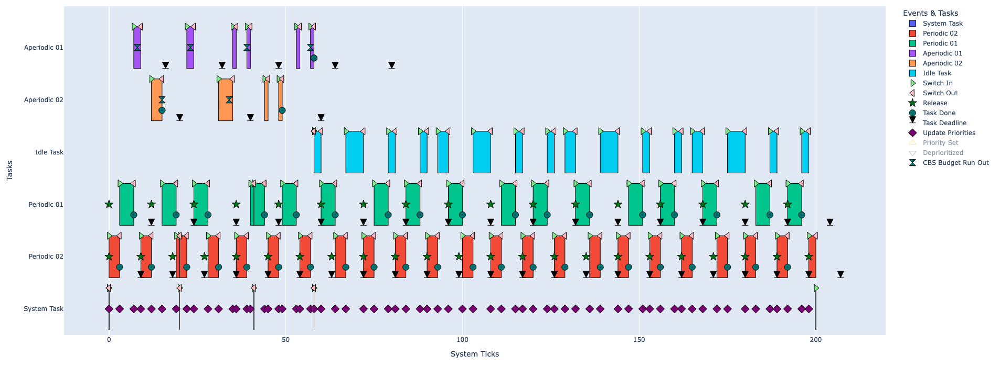

## Test 8 - Symmetric CBS Servers in Isolation

This test ascertains the ability for two CBS servers with the same maximum budget and period configurations to run without the presence of hard real-time tasks.

_CBS Servers_

|    Server     | Qs | Ts |
| :-----------: | :-----------: | :-----------: |
| S1 |       1       |       8       |
| S2 |       1       |       8       |

_Soft Real-Time Aperiodic Tasks_

|     Task      | Ci | ri | Si |
| :-----------: | :-----------: | :-----------: | :-----------: |
| a1 |       3       |       0       |       1       |
| a2 |       3       |       0       |       2       |
| a3 |       4       |      20       |       1       |
| a4 |       4       |      20       |       2       |
| a5 |       1       |      40       |       1       |
| a6 |       2       |      40       |       2       |

**Expected**

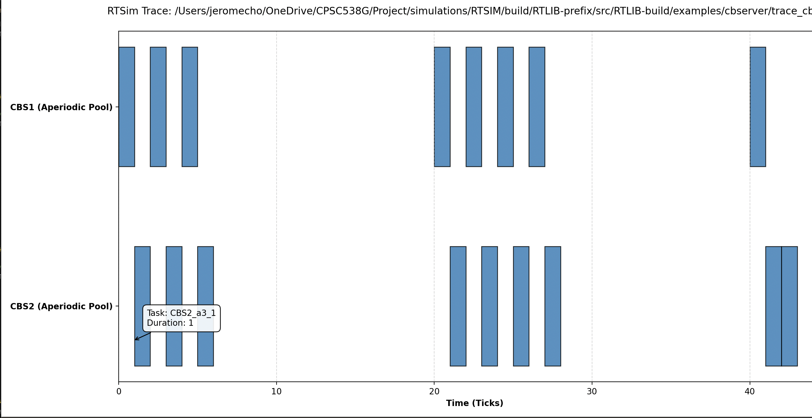

**Actual**

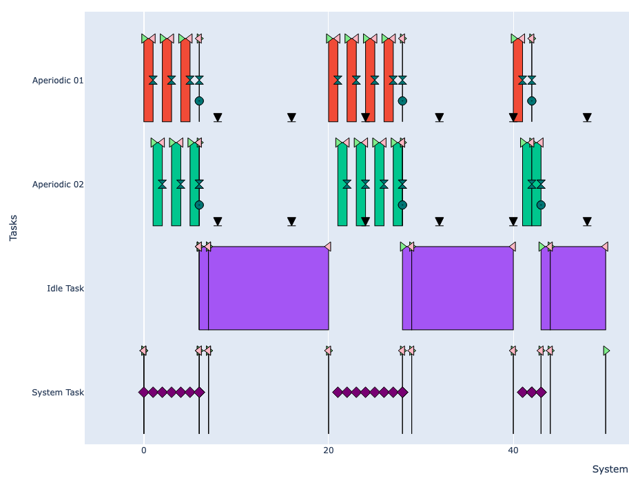

## Test 9 - Multiple (2) Aymmetric CBS Servers in Isolation

This test ascertains the ability for two CBS servers with different maximum budget and period configurations to run without the presence of hard real-time tasks.

_CBS Servers_

|    Server     | Qs | Ts |
| :-----------: | :-----------: | :-----------: |
| S1 |       1       |       8       |
| S2 |       4       |       8       |

_Soft Real-Time Aperiodic Tasks_

|     Task      | Ci | ri | Si |
| :-----------: | :-----------: | :-----------: | :-----------: |
| a1 |       3       |       0       |       1       |
| a2 |       3       |       0       |       2       |
| a3 |       4       |      20       |       1       |
| a4 |       4       |      20       |       2       |
| a5 |       1       |      40       |       1       |
| a6 |       2       |      40       |       2       |

**Expected**

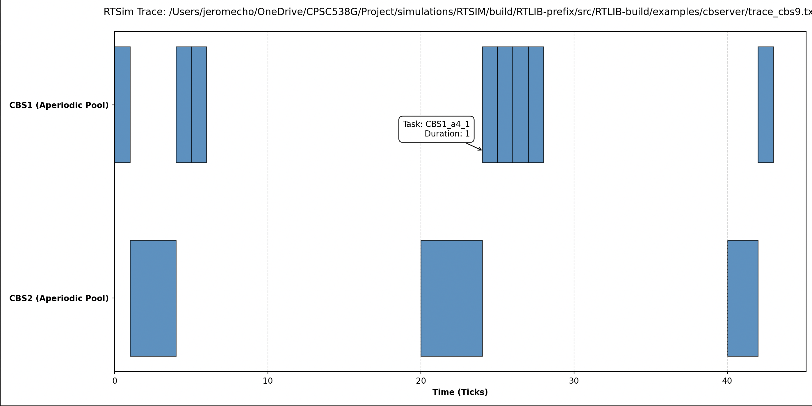

**Actual**

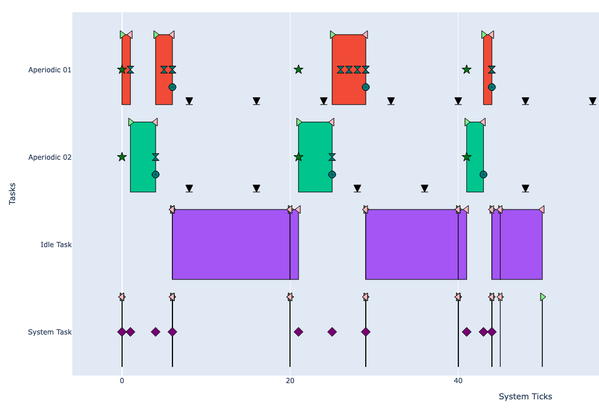

## Test 10 - Multiple (3) Asymmetric CBS Servers in Isolation

This tests the ability of our CBS implementation in handling numbers of CBS servers greater than 2. Furthermore, this test, along with several other tests, demonstrates our overrun management functionality. As seen in the trace below, the "CBS budget run out" event is being triggered multiple times (see the "hourglass icon" in the trace), and the server's deadline is correctly being postponed into the future, allowing tasks to continue running on a server as long as that server's deadline remains the earliest.

_CBS Servers_

|    Server     | Qs | Ts |
| :-----------: | :-----------: | :-----------: |
| S1 |       1       |       8       |
| S2 |       2       |       8       |
| S3 |       3       |       8       |

_Soft Real-Time Aperiodic Tasks_

|     Task      | Ci | ri | Si |
| :-----------: | :-----------: | :-----------: | :-----------: |
| a1 |       3       |       0       |       1       |
| a2 |       3       |       0       |       2       |
| a3 |       3       |       0       |       3       |
| a4 |       4       |      20       |       1       |
| a5 |       4       |      20       |       2       |
| a6 |       4       |      20       |       3       |
| a7 |       2       |      40       |       1       |
| a8 |       2       |      50       |       2       |
| a9 |       2       |      60       |       3       |

**Expected**

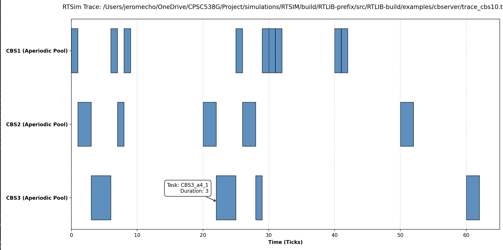

**Actual**

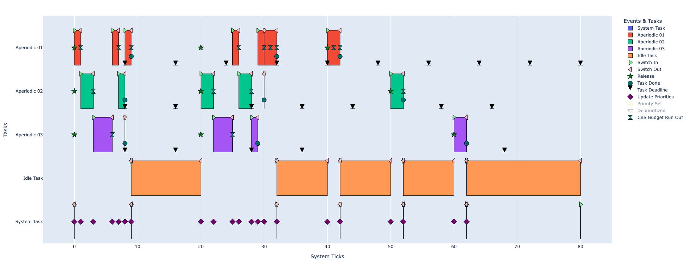

## Test 11 - Multiple (2) CBS servers running alongside 1 periodic task

This test ascertains the ability for 2 CBS servers to run alongside 1 periodic task - specifically aiming to target our system's ability to manage the budget of multiple CBS servers alongside a periodic task.

_CBS Servers_

|    Server     | Qs | Ts |
| :-----------: | :-----------: | :-----------: |
| S1 |       1       |       8       |
| S2 |       4       |       8       |

_Hard Real-Time Periodic Tasks_

|     Task      | Ci | ri | Di | Ti |
| :-----------: | :-----------: | :-----------: | :-----------: | :-----------: |
| p1 |       2       |       0       |       6       |       6       |

_Soft Real-Time Aperiodic Tasks_

|     Task      | Ci | ri | Si |
| :-----------: | :-----------: | :-----------: | :-----------: |
| a1 |       3       |       0       |       1       |
| a2 |       3       |       0       |       2       |
| a3 |       4       |      20       |       1       |
| a4 |       4       |      20       |       2       |
| a5 |       1       |      40       |       1       |
| a6 |       2       |      40       |       2       |

**Expected**

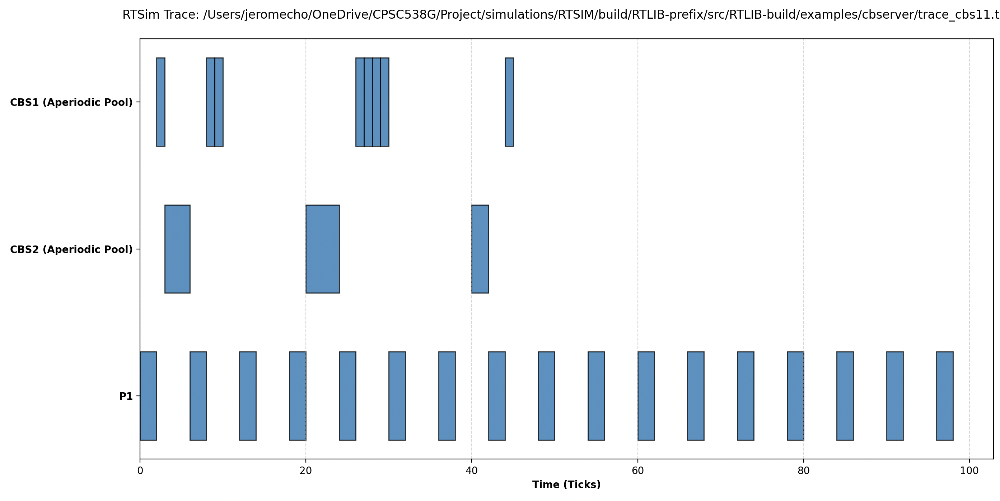

**Actual**

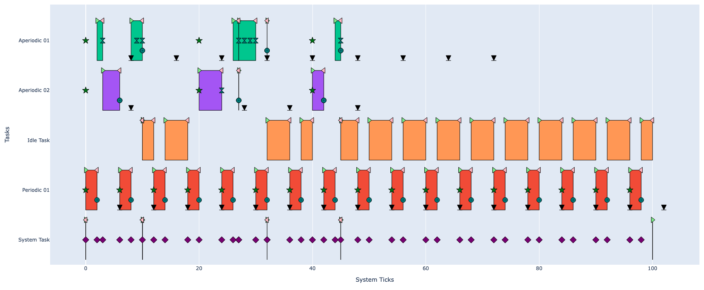

## Test 12 - Multiple (3) CBS servers running alongside 1 periodic task

This test ascertains the ability for 3 CBS servers to run alongside 1 periodic task - testing our system's ability to generalize budget keeping for more than 2 CBS servers while maintaining correctness for periodic tasks.

CBS Servers\*

|    Server     | Qs | Ts |
| :-----------: | :-----------: | :-----------: |
| S1 |       1       |       8       |
| S2 |       2       |       8       |
| S3 |       3       |       8       |

_Hard Real-Time Periodic Tasks_

|     Task      | Ci | ri | Di | Ti |
| :-----------: | :-----------: | :-----------: | :-----------: | :-----------: |
| p1 |       2       |       0       |       6       |       6       |

_Soft Real-Time Aperiodic Tasks_

|     Task      | Ci | ri | Si |
| :-----------: | :-----------: | :-----------: | :-----------: |
| a1 |       3       |       0       |       1       |
| a2 |       3       |       0       |       2       |
| a3 |       3       |       0       |       3       |
| a4 |       4       |      20       |       1       |
| a5 |       4       |      20       |       2       |
| a6 |       4       |      20       |       3       |
| a7 |       2       |      40       |       1       |
| a8 |       2       |      50       |       2       |
| a9 |       2       |      60       |       3       |

**Expected**

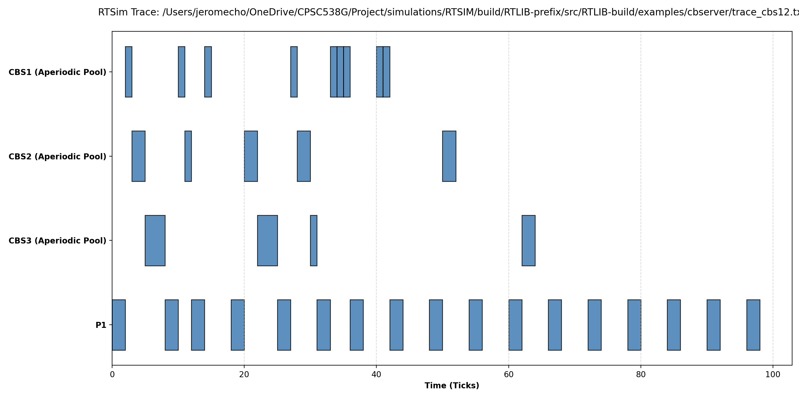

**Actual**

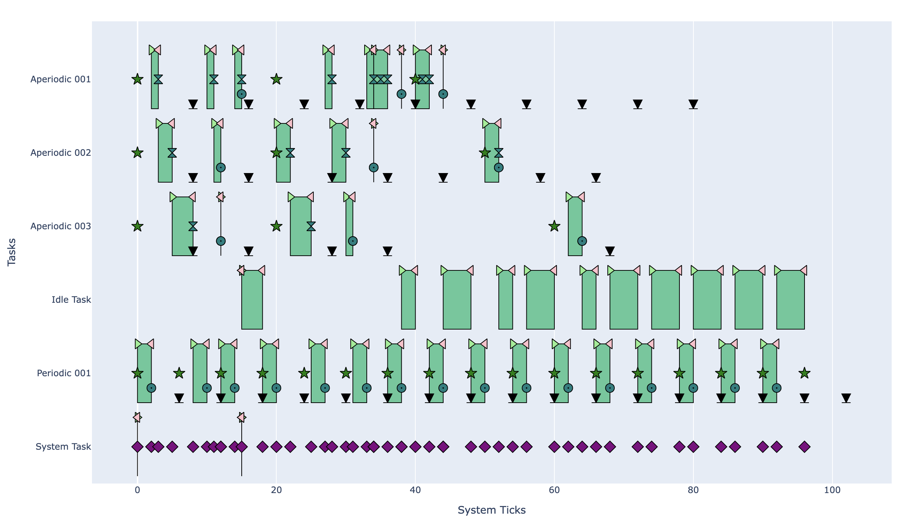

## Test 13 - 1 CBS Server, 1 periodic task. Bandwidth is high but load of aperiodic tasks is low (no deadline miss)

This test demonstrates that there exist scenarios in CBS where a high bandwidth server coexists with a periodic task without deadline misses occuring (provided the load of aperiodic tasks on that server is low). This makes sense bcause the bandwidth of a server is the _maximum_ utilization it can contribute to the total utilization (not the actual utilization).

|    Server     | Qs | Ts |
| :-----------: | :-----------: | :-----------: |
| S1 |       8       |       8       |

_Hard Real-Time Periodic Tasks_

|     Task      | Ci | ri | Di | Ti |
| :-----------: | :-----------: | :-----------: | :-----------: | :-----------: |
| p1 |       4       |       0       |       7       |       7       |

_Soft Real-Time Aperiodic Tasks_

|     Task      | Ci | ri | Si |
| :-----------: | :-----------: | :-----------: | :-----------: |
| a1 |       1       |       0       |       1       |
| a2 |       1       |       8       |       1       |
| a3 |       1       |      16       |       1       |

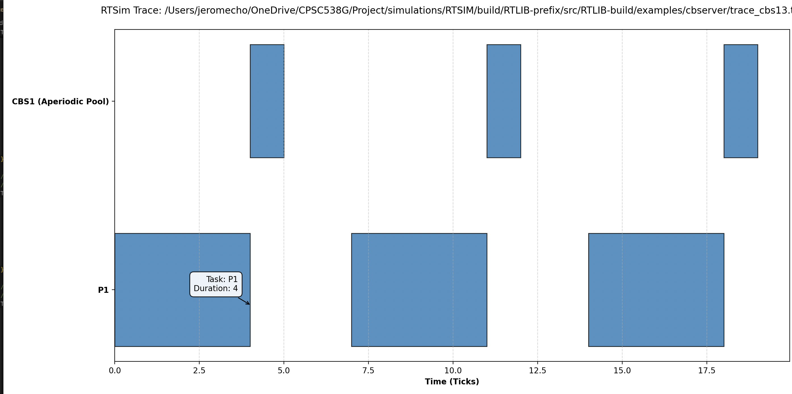

**Actual**

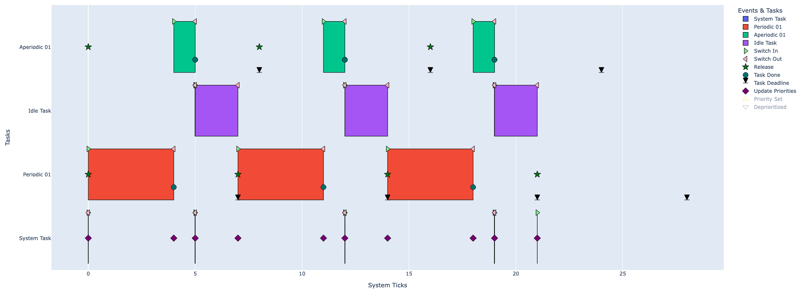

## Test 14 - 1 CBS Server, 1 periodic task. Bandwidth is high and load of aperiodic tasks is high (deadline miss)

This test demonstrates that a CBS setup of a high bandwidth server existing alongside a periodic task can cause a deadline miss with a particular set of aperiodic tasks (high load), when it wasn't causing a deadline miss with another set of aperiodic tasks (low load).

_CBS Servers_

|    Server     | Qs | Ts |
| :-----------: | :-----------: | :-----------: |
| S1 |       8       |       8       |

_Hard Real-Time Periodic Tasks_

|     Task      | Ci | ri | Di | Ti |
| :-----------: | :-----------: | :-----------: | :-----------: | :-----------: |
| p1 |       4       |       0       |       7       |       7       |

_Soft Real-Time Aperiodic Tasks_

|     Task      | Ci | ri | Si |
| :-----------: | :-----------: | :-----------: | :-----------: |
| a1 |       4       |       0       |       1       |
| a2 |       4       |       1       |       1       |
| a3 |       4       |       2       |       1       |
| a4 |       4       |       3       |       1       |
| a5 |       4       |       4       |       1       |

**Expected**

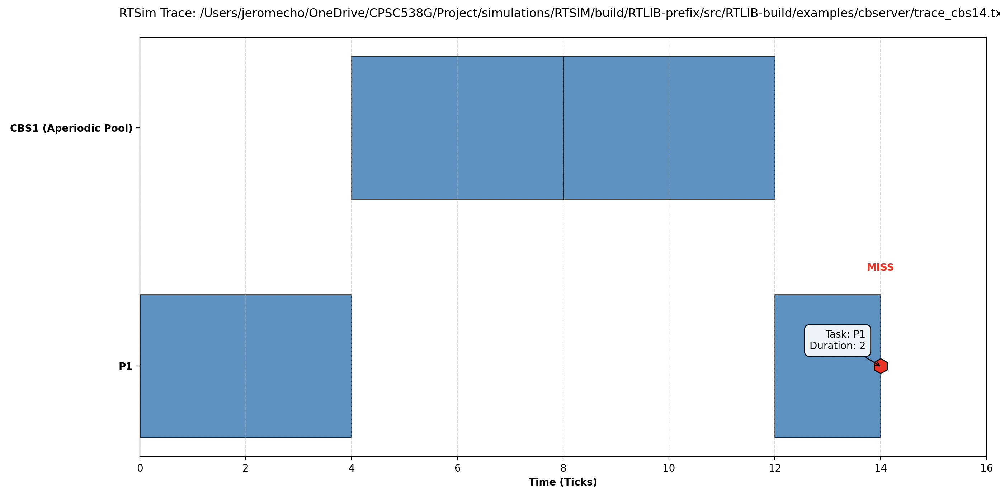

**Actual**

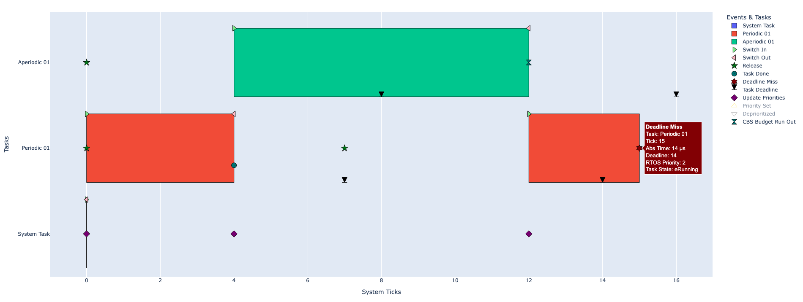

## Test 15 - Bandwidth just under deadline miss threshold (Total Utilization < 100%)

This test alongside the next 3 tests demonstrate how the bandwidth of a CBS server ensures the theoretical guarantee of a CBS server never contributing to the total utilization beyond the value of its bandwidth. Here the bandwidth is 3/8 and since total utilization (3/8 + 4/7) is less than 1, we get no deadline miss even under a heavy load of aperiodic tasks.

_CBS Servers_

|    Server     | Qs | Ts |
| :-----------: | :-----------: | :-----------: |
| S1 |       3       |       8       |

_Hard Real-Time Periodic Tasks_

|     Task      | Ci | ri | Di | Ti |
| :-----------: | :-----------: | :-----------: | :-----------: | :-----------: |
| p1 |       4       |       0       |       7       |       7       |

_Soft Real-Time Aperiodic Tasks_

|     Task      | Ci | ri | Si |
| :-----------: | :-----------: | :-----------: | :-----------: |
| a1 |       4       |       0       |       1       |
| a2 |       3       |       0       |       1       |
| a3 |       4       |       0       |       1       |
| a4 |       3       |       0       |       1       |
| a5 |       4       |       0       |       1       |
| a6 |       3       |       0       |       1       |

**Expected**

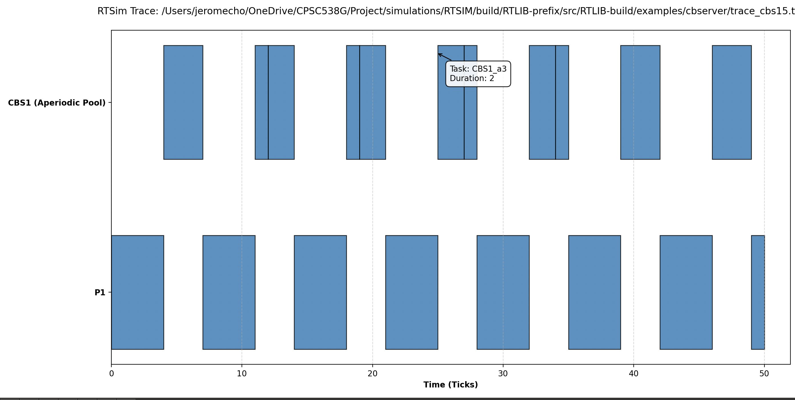

**Actual**

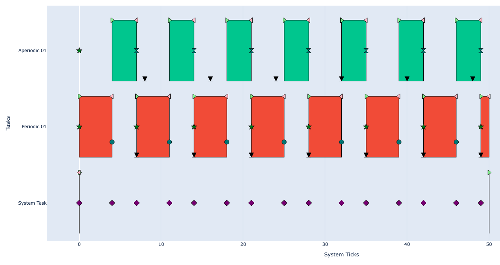

## Test 16 - Bandwidth at deadline miss threshold (Total Utilization = 100%)

This test desmontrates the correct lack of a deadline miss when total utilization is exactly 100%. Here, the test's bandwidth is 3/7 and since total utilization (3/7 + 4/7) is exactly equal to 1, we get no deadline miss even under a heavy load of aperiodic tasks.

\*_CBS Servers_

|    Server     | Qs | Ts |
| :-----------: | :-----------: | :-----------: |
| S1 |       3       |       7       |

_Hard Real-Time Periodic Tasks_

|     Task      | Ci | ri | Di | Ti |
| :-----------: | :-----------: | :-----------: | :-----------: | :-----------: |
| p1 |       4       |       0       |       7       |       7       |

_Soft Real-Time Aperiodic Tasks_

|     Task      | Ci | ri | Si |
| :-----------: | :-----------: | :-----------: | :-----------: |
| a1 |       4       |       0       |       1       |
| a2 |       3       |       0       |       1       |
| a3 |       4       |       0       |       1       |
| a4 |       3       |       0       |       1       |
| a5 |       4       |       0       |       1       |
| a6 |       3       |       0       |       1       |

**Expected**

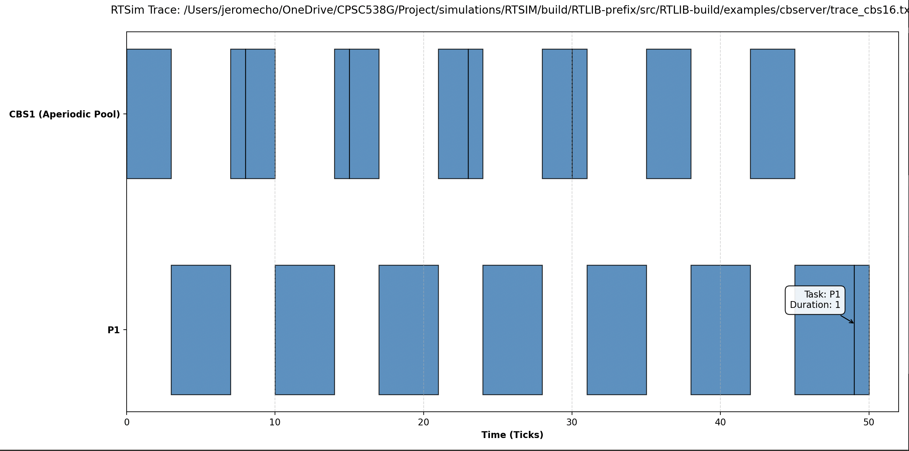

**Actual**

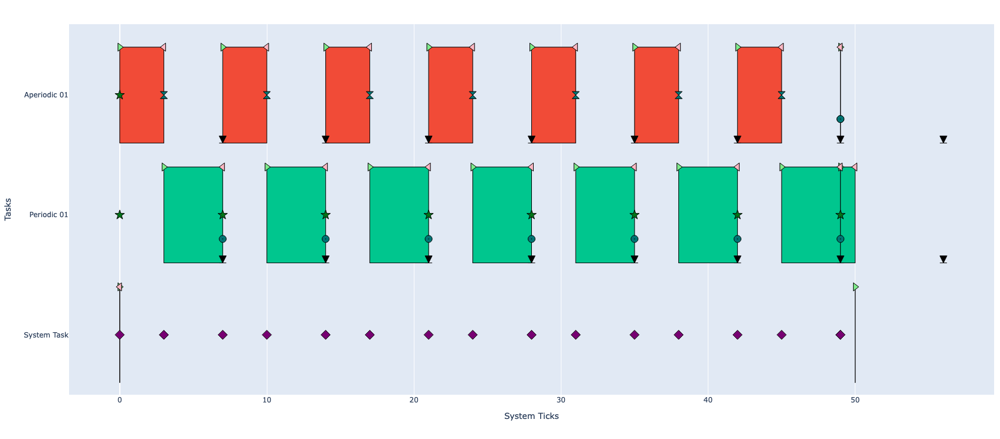

## Test 17 - Bandwidth just over deadline miss threshold (Total Utilization > 100%)

This test demonstrates the correct presence of a deadline miss when total utilization is greater than 100%. Here, the test's bandwidth is 4/8 and since total utilization (4/8 + 4/7) is greater than 1, we get a deadline miss under a heavy load of aperiodic tasks.

_CBS Servers_

|    Server     | Qs | Ts |
| :-----------: | :-----------: | :-----------: |
| S1 |       4       |       8       |

_Hard Real-Time Periodic Tasks_

|     Task      | Ci | ri | Di | Ti |
| :-----------: | :-----------: | :-----------: | :-----------: | :-----------: |
| p1 |       4       |       0       |       7       |       7       |

_Soft Real-Time Aperiodic Tasks_

|     Task      | Ci | ri | Si |
| :-----------: | :-----------: | :-----------: | :-----------: |
| a1 |       4       |       0       |       1       |
| a2 |       3       |       0       |       1       |
| a3 |       4       |       0       |       1       |
| a4 |       3       |       0       |       1       |
| a5 |       4       |       0       |       1       |
| a6 |       3       |       0       |       1       |

**Expected**

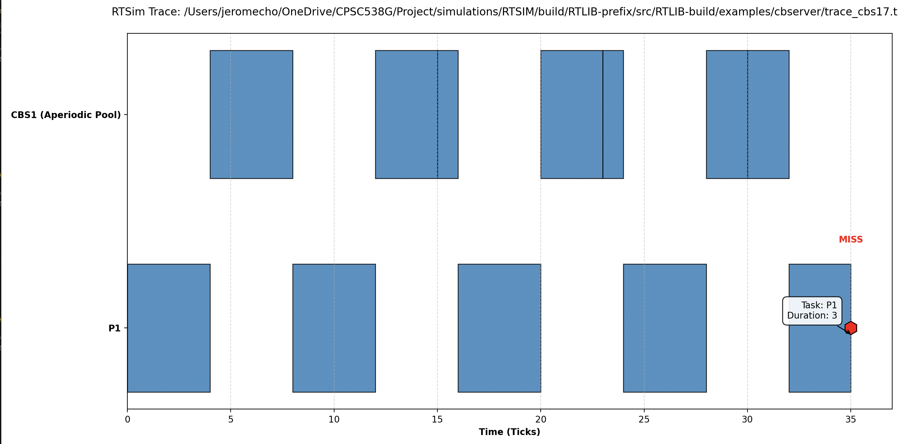

**Actual**

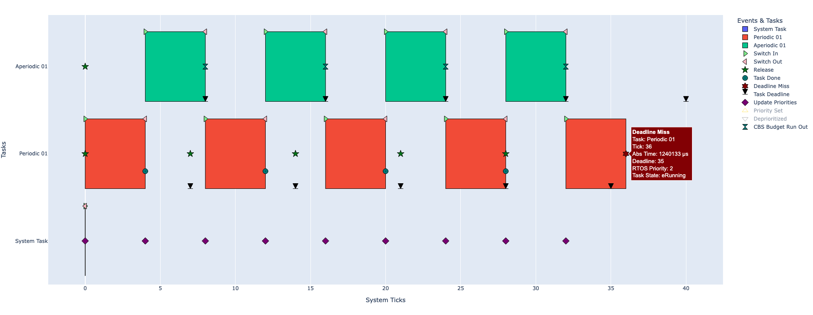

## Test 18 - Server with 100% Bandwidth (deadline miss)

This test demonstrates the correct presence of a deadline miss when total utilization is greater than 100% as a result of the server having a maximum bandwidth of 1. In the presence of any periodic task and any load non-empty load of aperiodic tasks, this server should cause a deadline miss.

_CBS Servers_

|    Server     | Qs | Ts |
| :-----------: | :-----------: | :-----------: |
| S1 |       8       |       8       |

_Hard Real-Time Periodic Tasks_

|     Task      | Ci | ri | Di | Ti |
| :-----------: | :-----------: | :-----------: | :-----------: | :-----------: |
| p1 |       4       |       0       |       7       |       7       |

_Soft Real-Time Aperiodic Tasks_

|     Task      | Ci | ri | Si |
| :-----------: | :-----------: | :-----------: | :-----------: |
| a1 |       4       |       0       |       1       |
| a2 |       3       |       0       |       1       |
| a3 |       4       |       0       |       1       |
| a4 |       3       |       0       |       1       |
| a5 |       4       |       0       |       1       |
| a6 |       3       |       0       |       1       |

**Expected**

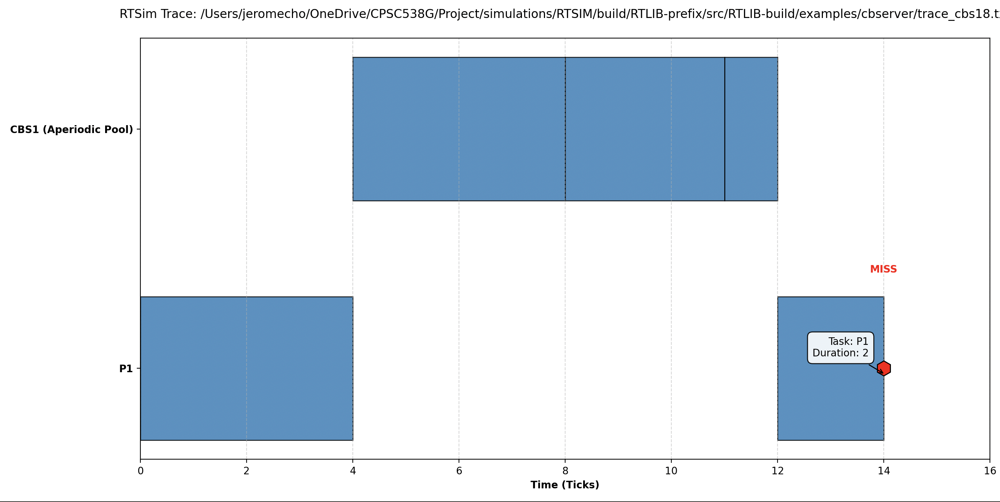

**Actual**

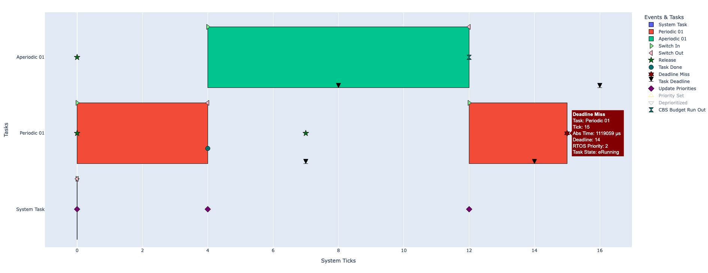

## Test 19 - Enabling flag favours CBS server in case of priority ties

The original markdown file describing the CBS requirments described that in the case of a priority tie, the CBS server was be favoured. This test demonstrates that if `FAVOUR_SERVER_EQUAL_PRIO` is enabled the CBS server will be favoured over the periodic task if both the server and task have equal deadlines.

_CBS Servers_

|    Server     | Qs | Ts |
| :-----------: | :-----------: | :-----------: |
| S1 |       8       |       8       |

_Hard Real-Time Periodic Tasks_

|     Task      | Ci | ri | Di | Ti |
| :-----------: | :-----------: | :-----------: | :-----------: | :-----------: |
| p1 |       4       |       0       |       8       |       8       |

_Soft Real-Time Aperiodic Tasks_

|     Task      | Ci | ri | Si |
| :-----------: | :-----------: | :-----------: | :-----------: |
| a1 |       4       |       0       |       1       |

**Expected**

As expected, we see the CBS server ("Aperiodic 001") being favoured over the periodic task.

**Actual**

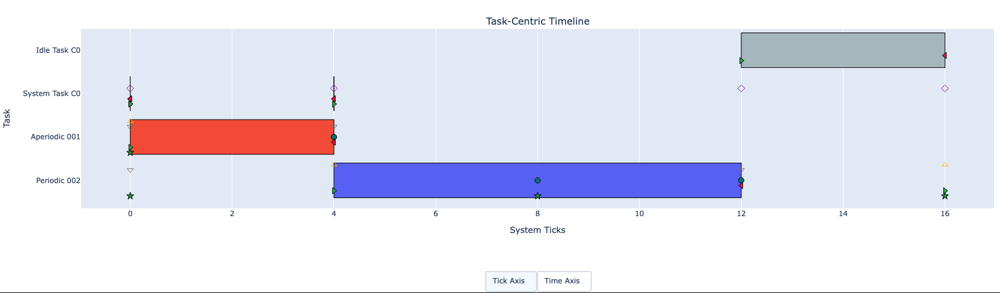
