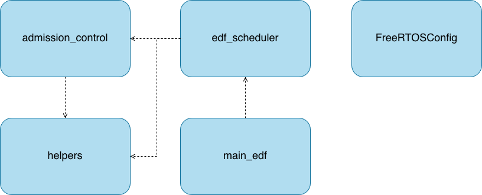
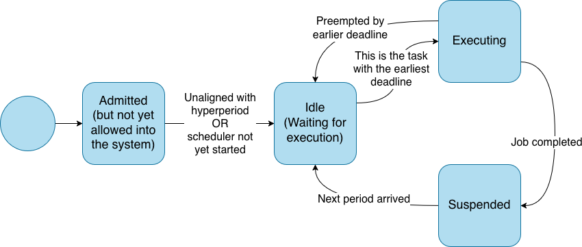
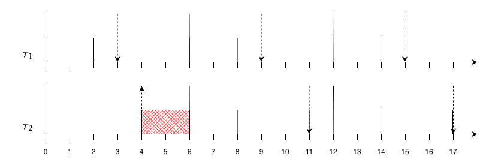

# EDF - Design

Our EDF implementation design description is divided into two parts. First, we provide a high-level system overview of our modules. Then, we dive into the details of how we handle scheduling by detailing a state diagram of tasks in our implementation.

## System Overview

_Figure 1.1 - System Overview_

`main_edf` is the main entrypoint to our application. Here, tasks are created, tests are run, and FreeRTOS hooks are defined. `edf_scheduler` contains the bulk of the logic for scheduling tasks and is used extensively in the body of FreeRTOS hooks. Meanwhile `admission_control` contains all the logic for admitting tasks, while `helpers` serves as a module for generic helper utilities - such as utilities for computing the hyperperiod of a set of tasks. Finally, `FreeRTOSConfig` is a configuration file imported by the FreeRTOS kernel `source` and sets up configurations such as tick frequency and FreeRTOS hooks.

All of these modules were defined as a wrapper layer on top of the FreeRTOS API. We rationalized this philosophy of minimizing kernel-level changes by emphasizing the ease and flexibility of generic interfaces built on top of FreeRTOS. Indeed, our implementation had minimal bugs, and now that we are implementing SRP, we are finding our design of a wrapper built on top of FreeRTOS to be easy to extend. Furthermore, since we didn't change FreeRTOS' kernel `source`, we can be confident in the correctness of FreeRTOS and avoid worrying about introducing bugs to the kernel.

These choices do have some drawbacks.

First, we increase the responsibility of the client by not changing the kernel and using wrapper layers. It is the responsibility of the client to call `taskDone` in their task once their task is finished. Had we made kernel-level changes, there may have been other ways to determine the completion of a task besides having the client call `taskDone`.

Second, a design changing the kernel may have offered some performance benefits. Regardless, our preference for simplicity and minimzing debugging time led us to choose an EDF implementation that built a wrapper on top of FreeRTOS.

## EDF Scheduling Logic

In order to use the EDF scheduling features, one has to call EDF-specific functions for creating tasks and notifying the kernel about when work has been completed (for periodic tasks).

The overarching design of our EDF implementation relies on maintaining a list of all periodic tasks, information about their periodicity (i.e. their deadlines, period, etc.), and whether or not they have completed their work for the current period of their execution.

The actual EDF scheduling happens at the beginning of each time slice, the smallest indivisible unit of time in FreeRTOS. The logic builds upon FreeRTOS, using task priorities to choose which tasks to execute at each time slice. By changing the priorities of each task based on the tasks deadline, no additional work is required by the extension layer to actually perform the context switching, allowing us to avoid writing any explicit logic for context switching.

A diagram showing the different states and state transitions for a task using our EDF scheduler is provided below. The transitions between these states are described in the sections below.

_Figure 1.2 - State diagram of tasks_

## Task creation

When a task is created, we store meta-information about the task in an array called TMB (Task Metadata Block). For periodic tasks (which is the only supported type of task for our EDF implementation), the TMB contains information about the required completion time, deadline, period, release time and whether a task has completed or not. There is also some additional information stored here to help with the implementation, which is not important when considering the design.

To create a task, our implementation provides an abstraction over the regular `xTaskCreate` function, which performs [admission control](design_EDF.md#Admission%20Control), initializes the relevant information in the TMB, [potentially aligns the new task with the hyperperiod of existing tasks](design_EDF.md#Admitting%20New%20Tasks%20During%20Execution) and finally calls `xTaskCreate` itself.

## Admission Control

When a task is created, the scheduler calls an algorithm implementing Theorem 4.6 from the textbook (shown below), in order to determine whether the system will be schedulable after the addition of a new task.

If the new task set is deemed unschedulable, the scheduler returns an error and doesn't create the new task, and the system continues its execution as normal.

One drawback of using Theorem 4.6 is that it may refuse task sets that have a utilization `U = 1` but that are still schedulable. To cover these cases, we could introduce additional conditional checks to see if periods equaled deadlines, and if so, used Liu and Layland's utilization bound criteria to determine task admission. This, however, would've introduced additional complexity for minimal marginal benefit. We eventually decided that a utilization `U = 1` was an edge case and that our implementation sufficied for correctly admitting only those task sets that were schedulable.

## Admitting New Tasks

If a task is admitted before the scheduler has been started, the scheduler extension will immediately consider it ready to run, its release time will not be altered. However, if a task needs to be admitted into the system after the scheduler has been started, its actual release is delayed until the next iteration of the hyperperiod of the current task set, since the function used to calculate the `demand_bound_function` assumes a synchronized task set. An example of this is shown below, where task τ2 is created at time t=4, but it is refused admission to the system until time t=6. Each task's parameters are shown below.

|  Task   | Ci | Di | Ti |
| :-----: | :-----: | :-----: | :-----: |
| τ1 |    2    |    3    |    6    |
| τ2 |    3    |    5    |    6    |

## Determining The Earliest Deadline

Our current implementation does not implement the logic described in the previous paragraph. Instead, a function in our tick hook simply checks if the currently running task equals the highest priority task, and if this condition does not hold, the extension will loop through it's list of TMBs to lower the priority of all tasks, before increasing the priority of the task with the new earliest deadline by calling the FreeRTOS API call `vTaskPrioritySet`. This effectively instructs the scheduler to perform a context switch to this task, and is how one task might be preempted by another.

Our current implementation is redundant and makes several unnecessary `O(n)` passes (this can be optimized in favour of a more event-driven solution as detailed in the "Future" section). Regardless of inefficiency, the simplicity of our design for determining the earliest deadline led to correct logic analyzer traces across all 11 tests with minimal logic written and virtually no bugs with the implementation.

## Marking A Task As Completed

For the scheduler to know when a task's deadline has been met, each task is responsible for notifying the scheduler about it's job completion. The task will then be suspended until its next time period, when it will be resumed by the scheduler.

## Deadline Misses

With admission control implemented, a deadline miss would be a rare occurrence. However, it might still happen due to tasks making blocking calls, bugs in the implementation or jitter during execution, and when this happens the scheduler will restart the system by using the `watchdog_reboot` function provided by the SDK.
