# EDF - Testing

## Overview

Testing our EDF implementation has been done by toggling GPIO pins, which have been assigned uniquely to each task. These signals were then monitored by a logic analyzer, and compared with a reference for correctness.

Correctness is primarily decided through comparison of the execution order of tasks to the expected execution order from the reference. Deadline misses will cause the system to restart, meaning we can focus more on the correctness of the EDF functionality itself, rather than schedulability of each task set.

For all of the testing performed, the top-most trace corresponds to the execution of the first task, the second top-most trace to the execution of the second task, etc. If there are five visible traces, the second bottom-most and the bottom-most traces correspond to the idle task and the timer task, respectively, which are both tasks created and managed by the kernel.

A python script was used to calculate the total utilization, hyperperiod and bounds, in order to make a prediction about the schedulability of each task set.

(_Note: This paragraph was added after demoing to TA_)

Finally, on the suggestion of the instructor during our demo, we added Test 12 to measure the cost of context switches in the context of our scheduler. Test 12 was plotted using our latest tracer testing framework described in the SRP Documentation.

## Test 1 - Smoke Test

This is the original test we used to show that the EDF scheduler was working at least somewhat correctly.

For test 1, the task set was defined as follows:
| Task | C<sub>i | D<sub>i | T<sub>i |
| :---: | :---: | :---: | :---: |
| τ<sub>1 | 2 | 6 | 6 |
| τ<sub>2 | 1 | 2 | 2 |

```txt
Total Utilization (U): 0.8333
Hyperperiod (H): 6
L* Bound: 0.00
Checking deadlines up to t = 6

t      | dbf(t)   | Status
-------------------------
2      | 1        | OK
4      | 2        | OK
6      | 5        | OK
-------------------------
Final Decision: SCHEDULABLE by EDF.
```

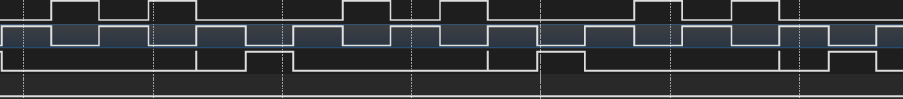

## Test 2 - EDF test case shown in the Q&A session

The second test recreates the test shown during the Q&A session the TA held. It has three tasks, with the following properties:
| Task | C<sub>i | D<sub>i | T<sub>i |
| :---: | :---: | :---: | :---: |
| τ<sub>1 | 2 | 4 | 6 |
| τ<sub>2 | 2 | 5 | 8 |
| τ<sub>3 | 3 | 7 | 9 |

```
Total Utilization (U): 0.9167
Hyperperiod (H): 72
L* Bound: 25.00
Checking deadlines up to t = 25

t      | dbf(t)   | Status
-------------------------
4      | 2        | OK
5      | 4        | OK
7      | 7        | OK
10     | 9        | OK
13     | 11       | OK
16     | 16       | OK
21     | 18       | OK
22     | 20       | OK
25     | 23       | OK
-------------------------
Final Decision: SCHEDULABLE by EDF.
```

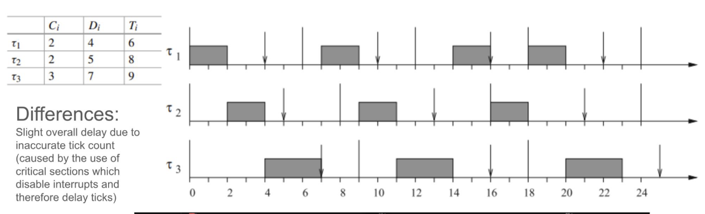
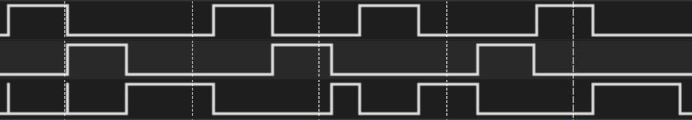

## Test 3 - A non-admissible task set

The third test shows the admission control in action. It attemps to create 100 tasks with the following properties:
| Task | C<sub>i | D<sub>i | T<sub>i |
| :---: | :---: | :---: | :---: |
| τ<sub>i | 15 | 500 | 1000 |

```
Total Utilization (U): 1.5000
Result: NOT Schedulable (U > 1)
```

As shown above, the total utilization of the task set is way above 1, meaning the task set is unschedulable, and therefore shouldn't be admitted.

The results from our scheduler shows that the admission control is working correctly:
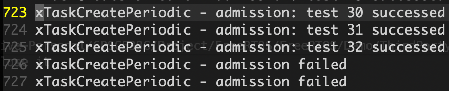

## Test 4 - An admissible task set

The fourth test demonstrates how the admission control allows all 100 tasks to be created when the task set should be schedulable. For this test, the following task parameters were used:
| Task | C<sub>i | D<sub>i | T<sub>i |
| :---: | :---: | :---: | :---: |
| τ<sub>i | 8 | 1000 | 1000 |

```
Total Utilization (U): 0.8000
Hyperperiod (H): 1000
L* Bound: 0.00
Checking deadlines up to t = 1000

t      | dbf(t)   | Status
-------------------------
1000   | 800      | OK
-------------------------
Final Decision: SCHEDULABLE by EDF.
```

Since the utilization of the tasks is below 1, the scheduler then goes on to check the processor demand bound, defined in theorem 4.6 which is shown below.  
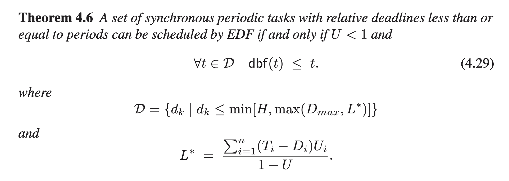

The results from our scheduler shows that the admission control is working correctly:
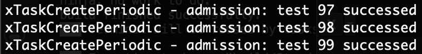

## Test 5 - A barely admissible task set (by utilization)

The fifth test demonstrates that 10 tasks which have a utilization equal to 0.9 passes admission control. The tasks parameters are shown below:
| Task | C<sub>i | D<sub>i | T<sub>i |
| :---: | :---: | :---: | :---: |
| τ<sub>i | 9 | 100 | 100 |

```
Total Utilization (U): 0.9
Hyperperiod (H): 100
L* Bound: 0.00
Checking deadlines up to t = 100

t      | dbf(t)   | Status
-------------------------
100    | 90      | OK
-------------------------
Final Decision: SCHEDULABLE by EDF.
```

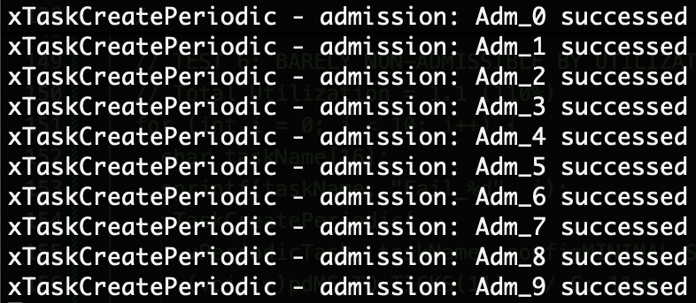

## Test 6 - A barely non-admissible task set (by utilization)

The sixth test demonstrates that 10 tasks which have a utilization just surpassing 1 fails admission control. The tasks parameters are shown below:
| Task | C<sub>i | D<sub>i | T<sub>i |
| :---: | :---: | :---: | :---: |
| τ<sub>i | 11 | 100 | 100 |

```
Total Utilization (U): 1.1000
Result: NOT Schedulable (U > 1)
```

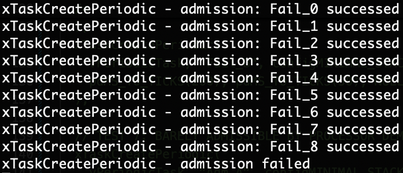

## Test 7 - A barely admissible task set (by processor demand)

The seventh test features a task set which was barely admissible when considering the processor demand (from Theorem 4.6, shown earlier). The task parameters are shown below:

|  Task   | C<sub>i | D<sub>i | T<sub>i |
| :-----: | :-----: | :-----: | :-----: |
| τ<sub>1 |   10    |   50    |   50    |
| τ<sub>2 |   40    |   50    |   200   |

```
Total Utilization (U): 0.4000
Hyperperiod (H): 200
L* Bound: 50.00
Checking deadlines up to t = 50

t      | dbf(t)   | Status
-------------------------
50     | 50       | OK
-------------------------
Final Decision: SCHEDULABLE by EDF.
```

The results show that both tasks were successfully admitted.

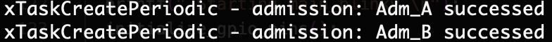

## Test 8 - A barely non-admissible task set (by processor demand)

The seventh test features a task set which is not admissible. Even though the utilization of the task set is only at 42%, processor demand is greater than 1 with L=50. The task parameters are as follows:

|  Task   | C<sub>i | D<sub>i | T<sub>i |
| :-----: | :-----: | :-----: | :-----: |
| τ<sub>1 |   11    |   50    |   50    |
| τ<sub>2 |   40    |   50    |   200   |

```
Total Utilization (U): 0.4200
Hyperperiod (H): 200
L* Bound: 51.72
Checking deadlines up to t = 52

t      | dbf(t)   | Status
-------------------------
50     | 51       | FAIL
-------------------------
Final Decision: NOT SCHEDULABLE by EDF.
```

In this case, the results show the scheduler correctly refusing to admit the second task:
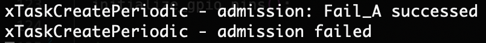

## Test 9 - Admitting a task after the scheduler has been started

As discussed in the design-document, admitting a new (periodic) task after the scheduler has been started is done by aligning its release with the current task set's hyperperiod. The ninth test attempts to release task 2 500 units of time after the first task is released.

|  Task   | C<sub>i | D<sub>i | T<sub>i |
| :-----: | :-----: | :-----: | :-----: |
| τ<sub>1 |   160   |   800   |   800   |
| τ<sub>2 |   400   |   800   |   800   |

```
Total Utilization (U): 0.7000
Hyperperiod (H): 800
L* Bound: 0.00
Checking deadlines up to t = 800

t      | dbf(t)   | Status
-------------------------
800    | 560      | OK
-------------------------
Final Decision: SCHEDULABLE by EDF.
```

The trace from the execution of this test shows how the second task doesn't start its execution immediately after being released, but rather aligns its release with the next iteration of the first task's period.
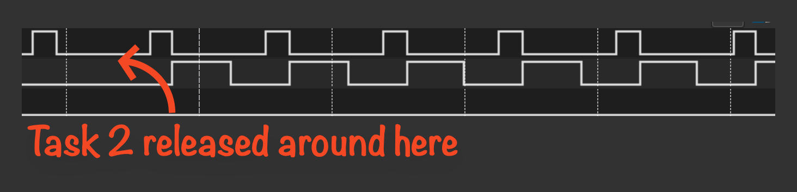

## Test 10 - Refusing to admit a task after the scheduler has been started

Test 10 features a task set which would be unschedulable given a second task which aligns its release with the period of the first task.

|  Task   | C<sub>i | D<sub>i | T<sub>i |
| :-----: | :-----: | :-----: | :-----: |
| τ<sub>1 |   20    |   100   |   100   |
| τ<sub>2 |   90    |   100   |   200   |

```
Total Utilization (U): 0.6500
Hyperperiod (H): 200
L* Bound: 128.57
Checking deadlines up to t = 129

t      | dbf(t)   | Status
-------------------------
100    | 110      | FAIL
-------------------------
Final Decision: NOT SCHEDULABLE by EDF.
```

Admission control in the scheduler correctly refuses the second task's admission, as shown in the output below:
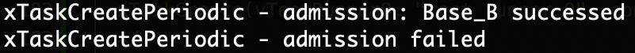

## Test 11 - Deadline misses during execution

A task which has passed admission control might still miss its deadline due to bugs in the code, jitter during execution or something similar, which the scheduler should handle. Our implementation of EDF should cause the system to reboot when this happens.

In order to test this, we disabled admission control and created a task set with the following parameters:
| Task | C<sub>i | D<sub>i | T<sub>i |
| :---: | :---: | :---: | :---: |
| τ<sub>1 | 40 | 100 | 100 |
| τ<sub>2 | 130 | 200 | 200 |

```
Total Utilization: 1.0500
Result: NOT Schedulable (U > 1)
```

As shown in the trace and output below, the scheduler reboots the system once the deadline miss occurs.

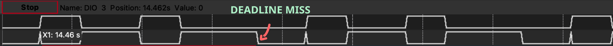
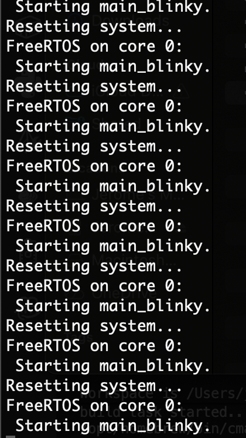

## Test 12 - Measuring the cost of context switches

The task set below was run for 20 ticks. The context switch was measured as the difference between the different between a switch out and a switch in.

_Task Set_

|  Task   | C<sub>i | D<sub>i | T<sub>i |
| :-----: | :-----: | :-----: | :-----: |
| τ<sub>1 |    1    |    2    |    2    |
| τ<sub>2 |    1    |    2    |    2    |

_Generated Trace_

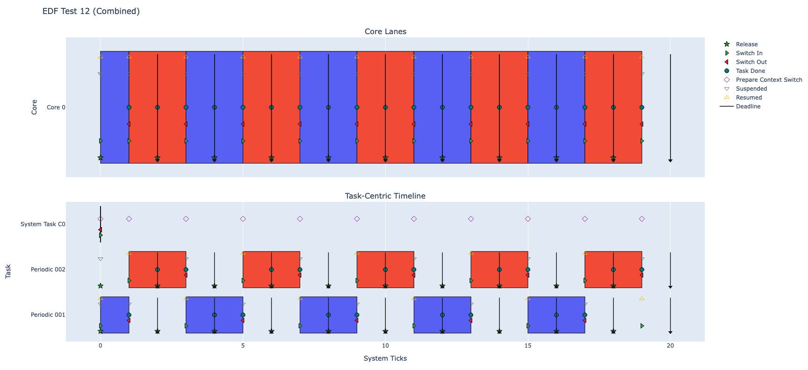

_Data_

| Switch Out (us) | Switch In (us) | Difference (us) |
| :-------------: | :------------: | :-------------: |
|      1701       |      1707      |        6        |
|      3626       |      3631      |        5        |
|      5627       |      5632      |        5        |
|      7624       |      7630      |        6        |
|      9624       |      9629      |        5        |
|      11624      |     11630      |        6        |
|      13624      |     13629      |        5        |
|      15624      |     15630      |        6        |
|      17624      |     17629      |        5        |
|      19624      |     19630      |        6        |

The average context switch cost was **5.5 $\mu s$**.

In a theoretical system, there would be no cost of a context switch, but in our system, after around 182 context switches, the costs due to context switches add up to 1 tick, potentially causing a task to miss its deadline in a long-running system. It is worth mentioning that since our EDF implementation is a wrapper around the FreeRTOS API, our implementation is not directly responsible for the switching in and out of tasks. Thus, the cost of a context switch in our system should be equivalent to that of the native FreeRTOS kernel.


