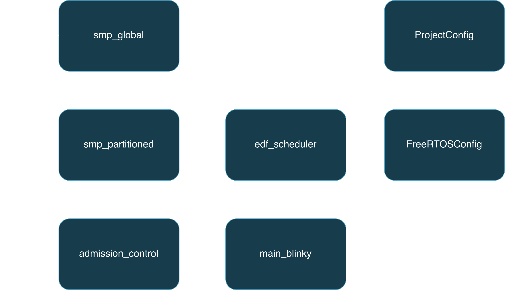
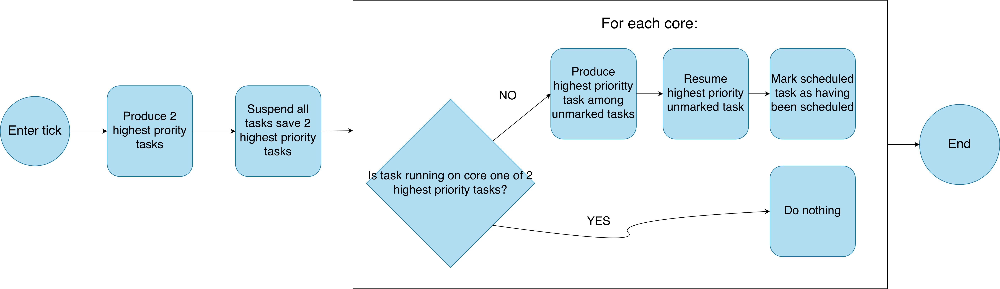

# MP - Design

Our SMP implementation design description is divided into three parts. First, we give a system overview. Second, we describe partitioned EDF scheduling. Finally, we describe global EDF scheduling. Each approach has distinct architectural requirements, and our implementation allows users to switch between them via compile-time configuration flags.

## System Overview

`main_blinky` remains the main entrypoint to the application. When SMP is enabled, either `smp_partitioned` or `smp_global` contains the API and logic for the selected scheduling algorithm. `admission_control` contains both per-core and global-level admission tests. `edf_scheduler` provides the underlying EDF scheduling primitives, while `helpers` offers shared utility functions like hyperperiod calculation. `FreeRTOSConfig` and `ProjectConfig` define platform and SMP-specific configuration, respectively.

The EDF scheduler is extended with SMP-specific hooks for both partitioned and global modes.

- `SMP_partitioned_check_deadlines()` or `SMP_global_check_deadlines()` checks for deadline misses and crashes the system upon failure.
- `SMP_partitioned_record_releases()` or `SMP_global_record_releases()` flags periodic tasks for release.
- `SMP_partitioned_suspend_and_resume_tasks()` or `SMP_global_suspend_and_resume_tasks()` implements the core scheduling decision logic.

The appropriate mode's functions are called based on the `USE_PARTITIONED` or `USE_GLOBAL` compile-time flag.

Like the EDF, SRP, and CBS implementations, the SMP layer is built as a wrapper on top of FreeRTOS's native SMP support. This keeps changes to FreeRTOS minimal and allows the scheduling logic to remain independent of kernel internals.

_Figure 1.1: System Overview_

## Partitioned EDF Scheduling

Partitioned scheduling assigns each task to a specific core at creation time and keeps it pinned there for its entire lifetime (barring explicit migration). Each core runs an independent EDF scheduler over its assigned task set.

### Core Concepts

A task is permanently assigned to one core via a `core` parameter at creation time. The task's stack, TCB, and metadata are all local to that core.

- Each core has its own isolated set of task stacks.
- Periodic task stacks are allocated as `private_stacks_periodic[core][slot]`.
- Aperiodic task stacks are allocated as `private_stacks_aperiodic[core][slot]`.

The implementation maintains separate task view sets for each core:

- `core_periodic_task_view_set[core]` holds pointers to the periodic tasks assigned to that core.
- `core_aperiodic_task_view_set[core]` holds pointers to the aperiodic tasks assigned to that core.

This separation ensures that each core's EDF scheduler reasons only about the tasks it owns.

### Task Creation and Assignment

When a user calls `SMP_create_periodic_task_on_core()`:

1. A memory slot is allocated for the task's stack, TCB and TMB.
2. Per-core admission control is performed using the existing EDF admission test.
3. The task's metadata block (TMB) is initialized with the assigned core stored in `assigned_core`.
4. The FreeRTOS task is created with FreeRTOS core affinity set to the target core, ensuring it only executes there.
5. The task is added to the destination core's view set.

### Task Migration

Partitioned scheduling also supports task migration, allowing a task to move from one core to another at runtime. This could be useful for load balancing or handling dynamic workloads.

When `SMP_migrate_task_to_core()` is called:

1. The source core is located using `SMP_find_task_location()`.
2. The destination core's admission control is checked with the migrating task's parameters.
3. The task is removed from the source core's view set and added to the destination core's view set.
4. The release time is aligned with the destination core's current hyperperiod to maintain the synchronized task-set assumption (similar to EDF's dynamic task admission).
5. The FreeRTOS core affinity is updated to the destination core.

### Scheduling Decision on a Single Core

Each core makes independent scheduling decisions every tick. `SMP_partitioned_produce_highest_priority_task(core)` returns the periodic task on that core with the earliest absolute deadline, or NULL if none are ready. All other ready tasks on the core are suspended. The highest-priority task is resumed, triggering a context switch if it's not already running.

This mirrors the uniprocessor EDF implementation, but applied independently per core.

## Global EDF Scheduling

### Core Concepts

Unlike partitioned scheduling, tasks in global scheduling can run on any core. There are no implementation requirement to separate tasks into different data structures based on the current core they were running on, so the data structures for storing a tasks' stack, TCB, and metadata are thus stored in the same data structures as in uniprocessor EDF:

- `periodic_task_view_set` and `aperiodic_task_view_set` hold pointers to periodic and aperiodic tasks
- `edf_private_task_buffers_periodic` and `edf_private_task_buffers_aperiodic` hold the TCBs of tasks
- `edf_private_stacks_periodic` and `edf_private_stacks_aperiodic` hold the stacks of tasks

We initially considered an implementation where global and partitioned scheduling shared the same data structures, with global scheduling dynamically moving task metadata around based on the core a task was currently running on. However, moving around task metadata introduced computational cost, potential for bugs (especially if FreeRTOS tasks maintained any sort of reference to task metadata) for benefit we couldn't see. Thus, for simplicity, correctness, and the requirement that global and partitioned scheduling didn't need to run simulatenously, we considered global and partitioned scheduling separate concerns and used different data structures.

### Task Creation

When a user calls `SMP_create_periodic_task`

1. A memory slot is allocated for the task's stack, TCB and TMB.
2. (If enabled) Admission control for global scheduling is performed.
3. The task's metadata block (TMB) is initialized and saved.
4. The FreeRTOS task is created with FreeRTOS core affinity set to the **either** core.
5. The task is added to the appropriate view set.

### Global Scheduling Decisions

The crux of our global scheduling logic is found in `SMP_global_suspend_and_resume_tasks`. `SMP_global_suspend_and_resume_tasks` runs every tick. The algorithm sees if it needs to perform a context switch for every core. The algorithm needs to perform a context for a core if the task currently running on core is not one of the 2 highest priority tasks. The algorithm identifies the two highest priority tasks, using existing infrastructure by performing a search **without replacement** for the highest priority task twice. Notably, the algorithm favours already running tasks over suspended tasks in the case of tasks having equal deadlines.

After identifying a context switch, the highest priority task is resumed (scheduled) and the task that was running on the core is suspended.

We notably do not set the core affinity of a task under global scheduling after initialization. We initially considered an approach where the core affinity of a resumed task would be set to the core that it should resume on. We specifically wanted to achieve this because we initially expected to test global scheduling using RTSIM and wanted a deterministic generation of traces for easy comparison with the simulator. When our testing strategy changed and we noticed that explicitly setting core affinities required additional implementation work to design around off-by-one errors in race conditions, we got rid of setting core affinities as that maintained correctness and simplicity.

_Figure 1.2: Flowchart summarizing core logic of global scheduling_

### Admission Control

Admission control for global scheduling is implemented based on the paper _Response-Time Analysis for globally scheduled Symmetric Multiprocessor Platforms_ by Bertogna and Cirinei (2007). The `SMP_can_admit_periodic_task()` function performs response-time analysis to determine if a new periodic task can be admitted without violating the schedulability of the existing task set. This is a more complex test than the per-core DBF-based test used in partitioned scheduling, as it must consider the global interaction of tasks across all cores.

The response-time analysis iteratively computes the worst-case response time of existing tasks and the newly added task, accounting for interference from higher-priority tasks and the fact that tasks can migrate between cores. If the computed response time exceeds a task's deadline, admission is rejected.

The paper presents three key equations for computing the response time, which are implemented in `admission_control.c`:

- The workload bound `W_i(t)` for a task `i` at time `t` (Equation 4 in the paper):

$$
W_i(L) = \left\lfloor\frac{L + D_i - C_i}{T_i}\right\rfloor C_i + \min\left(C_i, (L + D_i - C_i) \mod T_i\right)
$$

- The interference of a task `i` on a task `k` in an interval of length `D_k` (Equation 5 in the paper):

$$
\mathfrak{I}_{k}^{i}(D_{k}) = \text{DBF}_{k}^{i} + \min(C_{i}, \max(0, D_{k} - \text{DBF}_{k}^{i} \frac{T_{i}}{C_{i}})),
$$

- The bounded interference from task `tau_i` on task `tau_k` over interval of length R (From theorem 6 in the paper).

$$
\hat{I}_{k}^{i}(R_{k}^{ub}) = \min\left(W_{i}(R_{k}^{ub}), \mathfrak{I}_{k}^{i}(D_{k}), R_{k}^{ub} - C_{k} + 1\right)
$$

A fixed point iteration is performed to compute the response time `R_k` of a task `k`, continuing until either a maximum number of iterations is reached or the response time converges, starting at $R_{k}^{ub} = C_{k}$ and updating with the following formula (theorem 6 in the paper):

$$
R_{k}^{ub} \leftarrow C_{k} + \left\lfloor \frac{1}{m} \sum_{i \neq k} \hat{I}_{k}^{i}(R_{k}^{ub}) \right\rfloor
$$

If `R_k` exceeds the task's deadline, admission is rejected.

## Configuration Flags

The following compile-time flags control SMP behavior (defined in `ProjectConfig.h`):

| Flag                        | Effect                                                                         |
| :-------------------------- | :----------------------------------------------------------------------------- |
| `USE_MP`                    | Master switch: enables either partitioned or global multiprocessor scheduling. |
| `USE_PARTITIONED`           | Selects partitioned mode (mutually exclusive with `USE_GLOBAL`).               |
| `USE_GLOBAL`                | Selects global mode (default if neither flag is set).                          |
| `PERFORM_ADMISSION_CONTROL` | Enables/disables admission control.                                            |
