# MP - Testing

## Overview

The hardware-in-the-loop (HIL) testing framework described in the SRP documentation was employed and extended for SMP to generate reliable traces for SMP tests. Specifically, the following changes were made. First, the notion of a `core_id` was introduced into our captured traces. This allowed events to be associated with a particular core and plotted so that the specific cores an event was assocaited with could be visualized. Second, our regression testing test runner was fully automated. Instead of requiring the user to manually hold down the `BOOTSEL` button for the purposes of flashing a program, Picotool now automates the flashing of a program and the rebooting of a program. This now fully automates the running of all 69 regression tests.

Each test:

1. Defines a task set with specific parameters.
2. Creates all tasks (either on assigned cores in partitioned mode, or globally in global mode).
3. Allows the system to run for a (configurable) fixed duration.
4. Outputs collected traces.
5. Compares traces against expected behavior.

For partitioned scheduling, the first half of the tests were simply the tests defined for the EDF milestone, but run in parallell on both cores simultaneously. Since our approach manually assigns tasks to cores rather than using a partitioning strategy, verification of this was quite simple. Then, several tests were defined to verify that manual removal of tasks from cores and manual migration of tasks between cores worked as intended.

For global scheduling, initially we used the ReTIS Lab's RTSIM simulator to simulate global scheduling under EDF. However, due to minor real-time differences in the RTSIM simulator and our implementation, we realized midway into using RTSIM that RTSIM would not be a suitable tool for compariing our actual traces with the expected traces generated using RTSIM for all stress tests.

Based on this, we developed a verifier that analyzed the traces generated by a particular test for the following requirements: 1) Work Conservation, 2) EDF Guarantees (2 highest priority tasks always run), and 3) Execution Time (a task will always run for exactly its completion time). We developed unit tests to test our verifier and ran our verifier on tests that were already guaranteed to be correct by RTSIM. Then, we used our verifier on stress tests. The ability for the verifier to uncover small errors, such as off-by-one errors built our confidence in our implementation. We also sanity checked the plotted traces of tests after running the verifier. The verifier and tests can be seen here: https://github.com/jeromecho/CPSC-538G---FreeRTOS-Projects/tree/4-smp/_verifiers.

One fundamental limitation with using a verifier is that the correctness of the verifier is not guaranteed without extensive testing of the verifier itself. Meanwhile, using well-cited simulators like RTSIM gives us confidence that the expected traces generated by the simulator are correct. However, differences in the RTSIM simulator implementation (event-driven) and our implementation (tick hook based) and implementation details that prevented our generated traces from exactly equaling RTSIM's generated traces even with modifications to the RTSIM codebase made the usage of the verifier a better option, even with its limitations.

Finally, similar to our work for the EDF Documentation, we wrote a python script to validate our admission control functionality for global EDF scheduling. This script simulated the Bertogna and Cirinei's algorithm and produced the first admission control violation encountered. We did not provide detailed test descriptions for partitioned scheduling admission control because the tests replicated EDF admission control tests and used the exact same admission control algorithm. For more details on why particular task sets are admissible and some are not in the context of partitioned scheduling, please refer to EDF Documentation.

# Partitioned Scheduling

## Test 1 - Basic EDF validation on multiple cores

Baseline test verifying that EDF scheduling works correctly on each core independently. The same simple two-task test set from EDF Test 1 is deployed on all cores.

|     Task      | Ci | Ti | Di |
| :-----------: | :-----------: | :-----------: | :-----------: |
| τ1 |       2       |       6       |       6       |
| τ2 |       1       |       2       |       2       |

Total Utilization per core (U): 0.8333

The test verifies that all cores execute their assigned task sets correctly in EDF order.

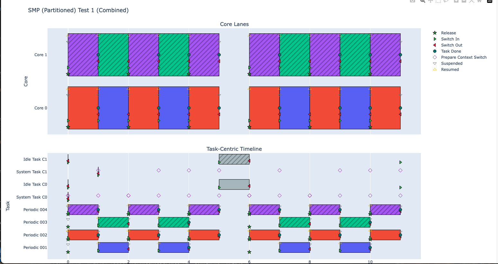

## Test 2 - EDF Q&A reference case on multiple cores

Replicates EDF Test 2 on each core. Three tasks with varying periods and deadlines are scheduled independently on each core.

|     Task      | Ci | Ti | Di |
| :-----------: | :-----------: | :-----------: | :-----------: |
| τ1 |       2       |       6       |       4       |
| τ2 |       2       |       8       |       5       |
| τ3 |       3       |       9       |       7       |

Total Utilization per core (U): 0.9167

Validates that more complex task sets maintain correct EDF ordering across all cores in parallel.

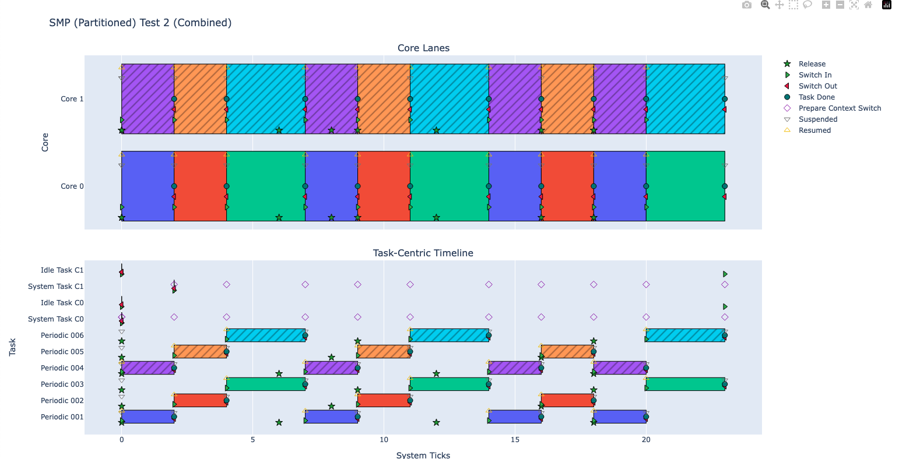

## Test 3 - 100 Tasks non-admissible per-core task set

Tests admission control with 100 tasks per core, each with high computation cost relative to period, making the total per-core utilization 1.5 (unschedulable).

|     Task      | Ci | Ti | Di |
| :-----------: | :-----------: | :-----------: | :-----------: |
| τi |      15       |     1000      |      500      |

Total Utilization per core (U): 1.5000

Verifies that admission control correctly rejects each core's task set due to exceeding utilization limits.

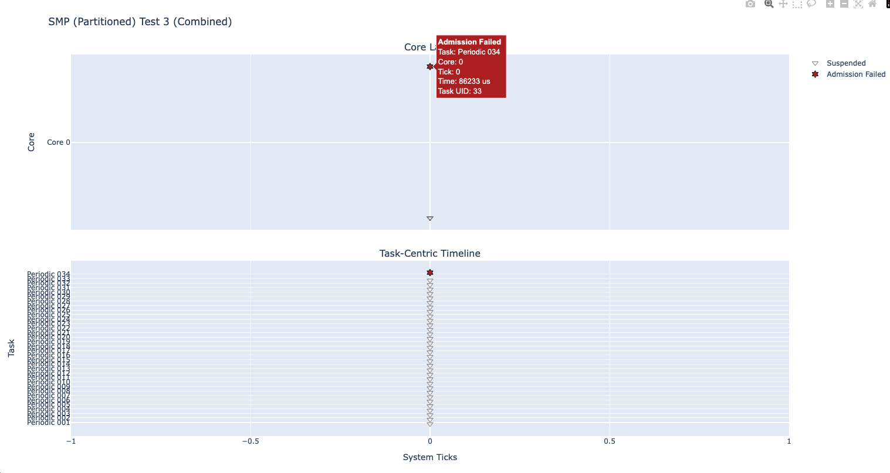

## Test 4 - 100 Tasks admissible per-core task set

Demonstrates admission control accepting 100 tasks per core when utilization is below 1. Each core independently schedules the same 100 tasks.

|     Task      | Ci | Ti | Di |
| :-----------: | :-----------: | :-----------: | :-----------: |
| τi |       8       |     1000      |     1000      |

Total Utilization per core (U): 0.8000

Verifies that admission control correctly accepts schedulable tasks and applies processor demand analysis per core.

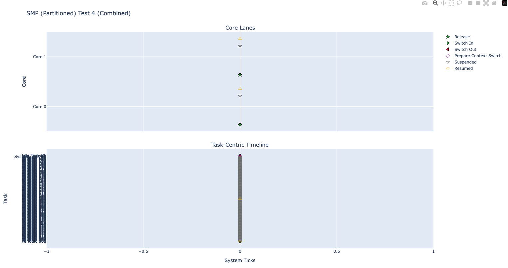

## Test 5 - Barely admissible per-core task set (U = 0.9)

Tests boundaries of admission control with per-core utilization of exactly 0.9. Ten tasks per core with high relative utilization pass admission.

|     Task      | Ci | Ti | Di |
| :-----------: | :-----------: | :-----------: | :-----------: |
| τi |      10       |      100      |      100      |

Total Utilization per core (U): 0.9000

Validates that admission control boundaries work correctly per core.

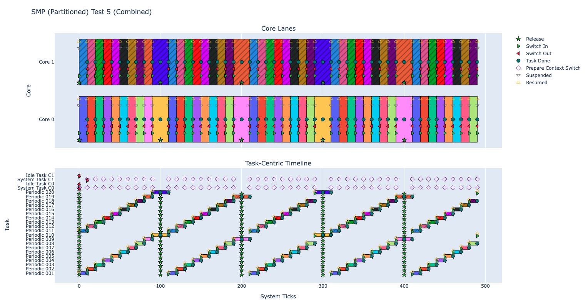

## Test 6 - Barely non-admissible per-core task set (U > 1)

Tests admission control rejection boundary with per-core utilization of 1.1. Confirms tasks are rejected when total utilization exceeds 1 per core.

|     Task      | Ci | Ti | Di |
| :-----------: | :-----------: | :-----------: | :-----------: |
| τi |      11       |      100      |      100      |

Total Utilization per core (U): 1.1000

Verifies admission control correctly rejects slightly-unschedulable task sets.

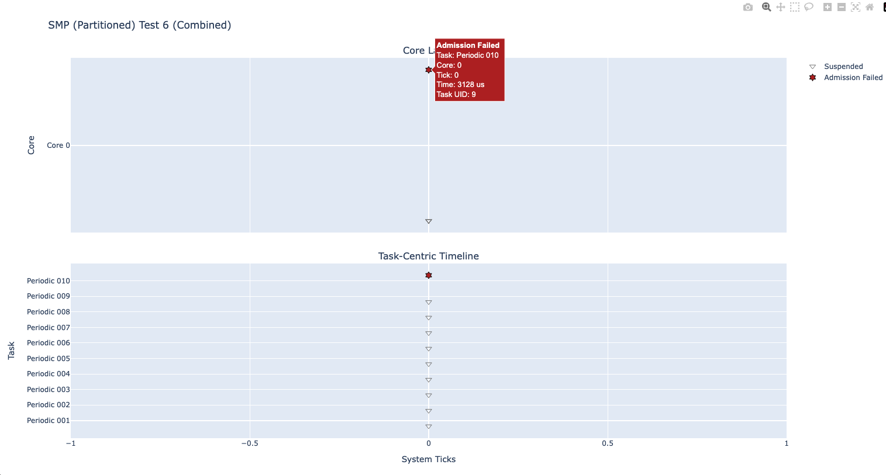

## Test 7 - Barely admissible per-core task set (by processor demand)

Replicates EDF Test 7 on all cores. Tests the processor demand bound with a task set that passes utilization but is tight on processor demand.

|     Task      | Ci | Ti | Di |
| :-----------: | :-----------: | :-----------: | :-----------: |
| τ1 |      10       |      50       |      50       |
| τ2 |      40       |      200      |      50       |

Total Utilization per core (U): 0.4000

Validates per-core processor demand analysis under tight constraints.

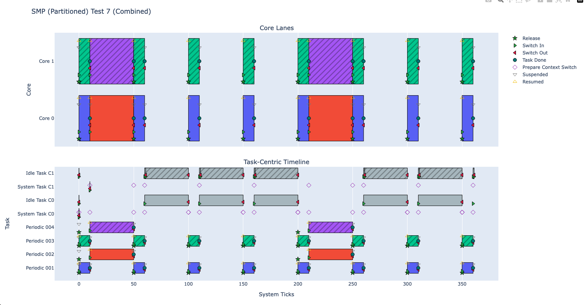

## Test 8 - Barely non-admissible per-core task set (by processor demand)

Replicates EDF Test 8 on all cores. Processor demand exceeds capacity at critical point, causing the second task's rejection on each core.

|     Task      | Ci | Ti | Di |
| :-----------: | :-----------: | :-----------: | :-----------: |
| τ1 |      11       |      50       |      50       |
| τ2 |      40       |      200      |      50       |

Total Utilization per core (U): 0.4200

Confirms per-core processor demand analysis rejects unschedulable task sets even when utilization is low.

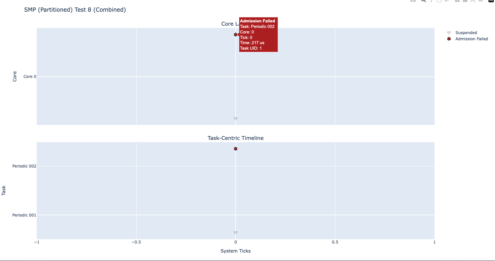

## Test 9 - Per-core drop-in task admission

Similar to EDF Test 9, but separate tasks are dropped into each core at offset times. A base task set on each core receives an additional task 500 time units after scheduler start. Each core independently verifies the new task's admission and execution.

Base tasks per core:
| Task | Ci| Ti| Di|
| :---: | :---: | :---: | :---: |
| τbase| 160 | 800 | 800 |

Drop-in tasks per core:
| Task | Ci| Ti| Di|
| :---: | :---: | :---: | :---: |
| τdrop-in| 400 | 800 | 800 |

Validates per-core task admission control after scheduler initialization.

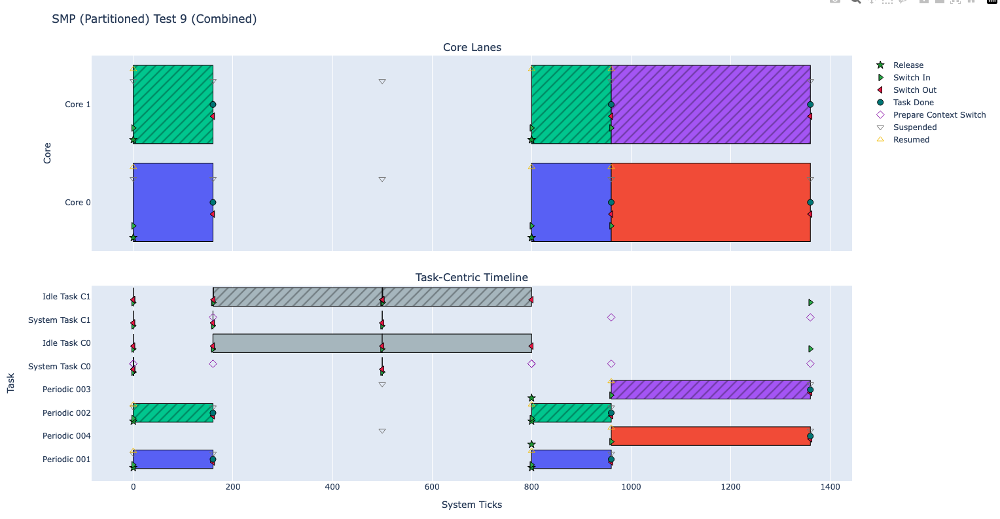

## Test 10 - Per-core drop-in task rejection

Similar to EDF Test 10, but each core independently attempts to add an unschedulable drop-in task 500 time units after initialization. Tasks added should be rejected due to per-core processor demand violations.

Base tasks per core:
| Task | Ci| Ti| Di|
| :---: | :---: | :---: | :---: |
| τbase| 20 | 100 | 100 |

Drop-in tasks per core (unschedulable):
| Task | Ci| Ti| Di|
| :---: | :---: | :---: | :---: |
| τdrop-in| 90 | 200 | 100 |

Validates per-core rejection of admission requests that violate processor demand constraints.

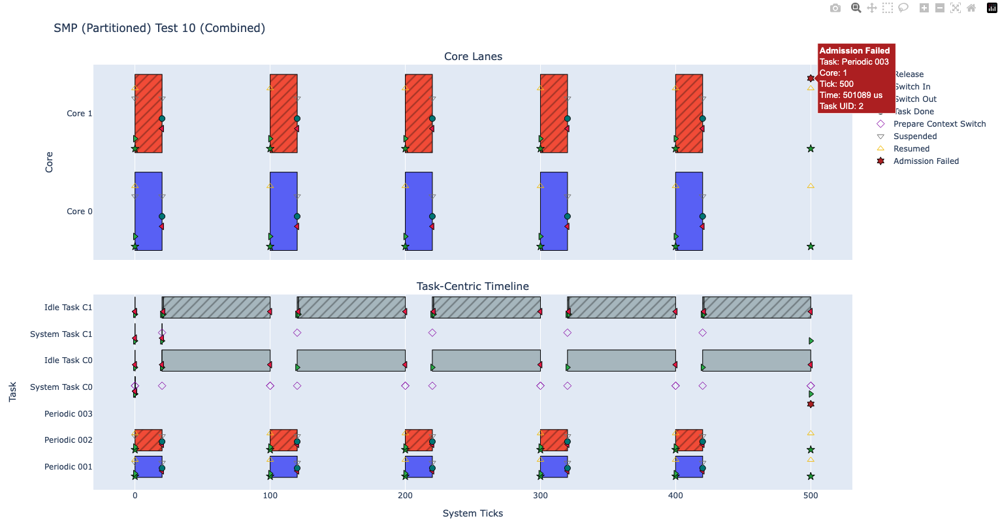

## Test 11 - Missed Deadline

Partitioned counterpart of EDF11. This test verifies deadline-miss behavior under partitioned scheduling by running a task set that is expected to miss its deadline. For this test, admission control is bypassed to allow an unschedulable task set to be added to each core. Only one core will report a deadline miss, since the test is ended after the first miss is observed.

Tasks per core (unschedulable):
| Task | Ci| Ti| Di|
| :---: | :---: | :---: | :---: |
| τ1| 50 | 120 | 50 |
| τ2| 130 | 200 | 200 |

Expected outcome: a deadline miss trace event is observed.

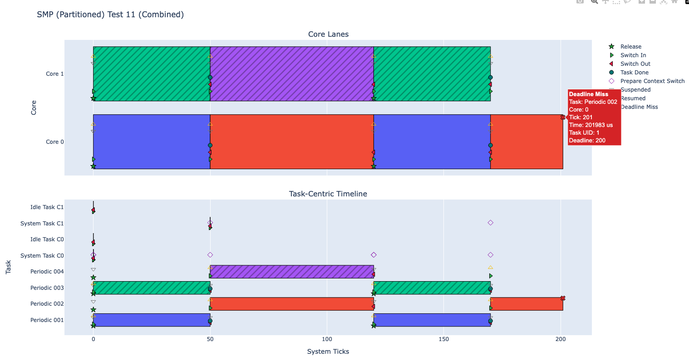

## Test 12 - Removal of a task from a core

Tests removal of tasks from different cores during the same scheduler cycle. One task is removed from core 0 and tasks are verified on core 1 to ensure removal on one core doesn't affect the other.

Initial tasks:
| Task | Ci| Ti| Di| Core |
| :---: | :---: | :---: | :---: | :--- |
| τremove| 6 | 20 | 20 | Core 0 |
| τkeep | 6 | 20 | 20 | Core 1 |

Runner: Removes core 0 task and verifies core 1 task remains scheduled

Validates isolation of removal operations across cores.

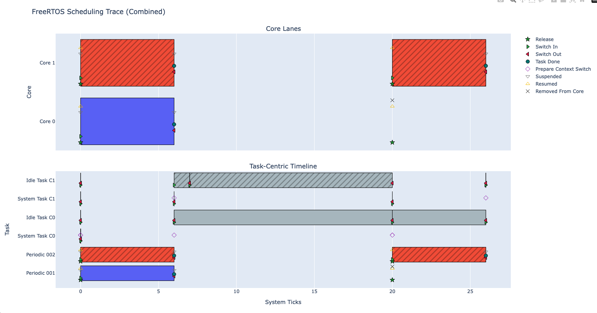

## Test 13 - Migrating a task to a busy core

Tests whether migrating a task to a busy core is possible. A single task is migrated from core 0 to core 1 during execution. Verifies migration succeeds and task executes on the new core.

Initial tasks:
| Task | Ci| Ti| Di| Core |
| :---: | :---: | :---: | :---: | :--- |
| τmigrate | 5 | 16 | 16 | Core 0 |
| τbaseline| 2 | 16 | 12 | Core 1 |

Migration at t=20: Migrates core 0 task to core 1

Validates basic task migration functionality.

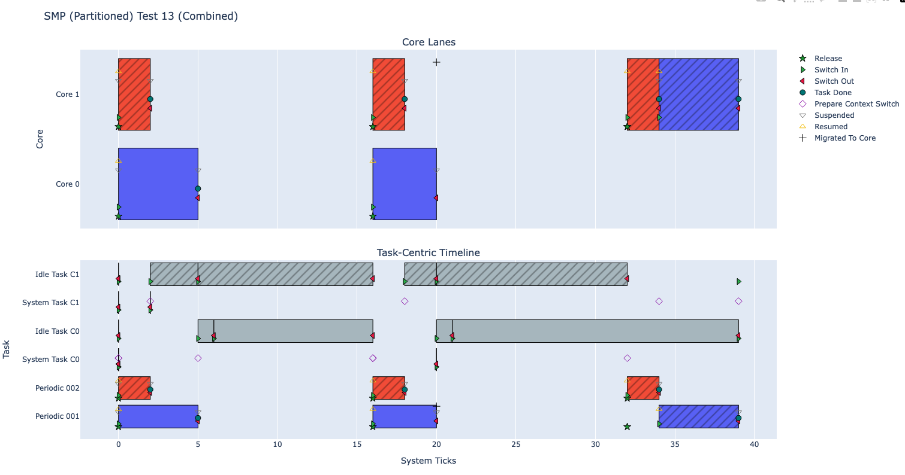

## Test 14 - Migrating a task to an idle core

Tests a single task migration from core 0 to core 1 with baseline tasks on each core for comparison. The migrating task transitions from one core's scheduler to the other mid-execution.

Initial tasks:
| Task | Ci| Ti| Di| Core |
| :---: | :---: | :---: | :---: | :--- |
| τmigrate | 5 | 12 | 12 | Core 0 |
| τbaseline| 3 | 8 | 8 | Core 0 |

Migration at t=15: Migrates core 0 task to core 1

Validates detailed trace of single migration event.

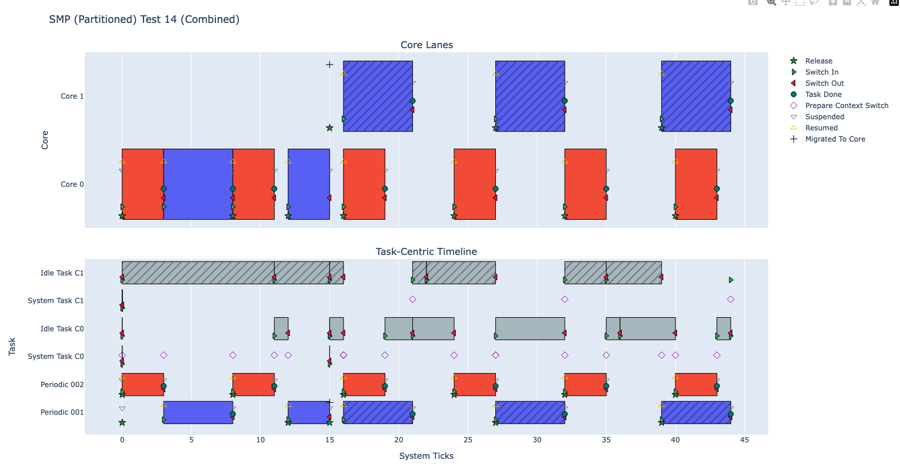

## Test 15 - Round-trip migration (core 0 to core 1 to core 0)

Tests repeated migration of the same task. A task is migrated from core 0 to core 1, then back to core 0 after its job completes. Verifies correct handling of multiple migrations.

Initial tasks:
| Task | Ci| Ti| Di| Core |
| :---: | :---: | :---: | :---: | :--- |
| τmigrate | 4 | 10 | 8 | Core 0 |
| τbaseline| 2 | 10 | 10 | Core 0 |
| τbaseline| 2 | 10 | 10 | Core 1 |

Migrations:

- t=12: Migrate to core 1
- t=23: Migrate back to core 0

Validates that repeated migrations maintain correctness.

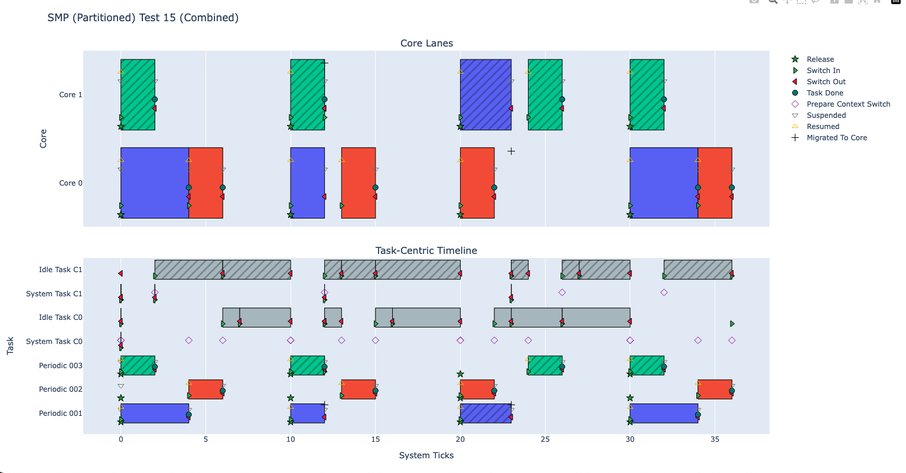

## Test 16 - Simultaneous cross-core migration while idle

Tests two tasks migrating in opposite directions within the same migration window. One task moves from core 0 to core 1 while another moves from core 1 to core 0. Verifies that simultaneous migrations on different cores don't interfere.

Initial tasks:
| Task | Ci| Ti| Di| Core |
| :---: | :---: | :---: | :---: | :--- |
| τc0-c1 | 2 | 5 | 4 | Core 0 |
| τbaseline| 1 | 5 | 5 | Core 0 |
| τc1-c0 | 2 | 5 | 4 | Core 1 |
| τbaseline| 1 | 5 | 5 | Core 1 |

Migrations at t=4:

- Core 0 task migrates to Core 1
- Core 1 task migrates to Core 0

Validates isolation of concurrent migrations across cores.

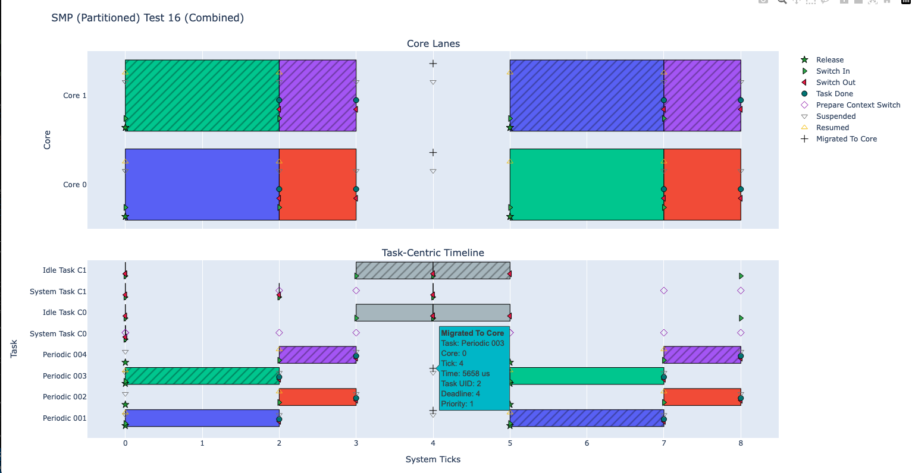

## Test 17 - Simultaneous migration while both source tasks are active

Similar to Test 16, but migrations occur earlier (t=1) while both source tasks are still executing. Both cores perform simultaneous migrations while jobs are active, testing migration during a task's execution doesn't cause issues when performed on simultaneously on both cores.

Initial tasks:
| Task | Ci| Ti| Di| Core |
| :---: | :---: | :---: | :---: | :--- |
| τc0→c1 | 2 | 5 | 4 | Core 0 |
| τbaseline| 1 | 5 | 5 | Core 0 |
| τc1→c0 | 2 | 5 | 4 | Core 1 |
| τbaseline| 1 | 5 | 5 | Core 1 |

Migrations at t=1 (during active execution):

- Core 0 task migrates to Core 1
- Core 1 task migrates to Core 0

Validates migration correctness under higher scheduling pressure.

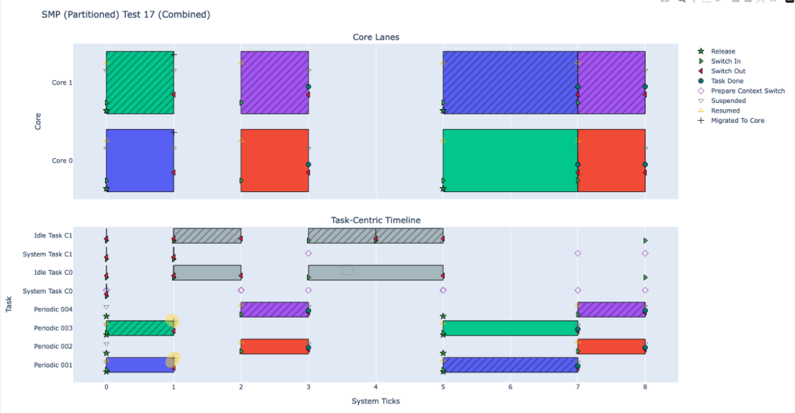

## Test 18 - Staggered migrations

Tests two migrations occurring at different aligned time points. The first task migrates early to core 1, then a second task migrates to core 0 at a later aligned tick. Verifies that staggered migrations maintain schedulability.

Initial tasks:
| Task | Ci| Ti| Di| Core |
| :---: | :---: | :---: | :---: | :--- |
| τearly | 2 | 6 | 5 | Core 0 |
| τbaseline| 1 | 6 | 6 | Core 0 |
| τlate | 2 | 6 | 5 | Core 1 |
| τbaseline| 1 | 6 | 6 | Core 1 |

Migrations:

- t=3: Migrate core 0 task to core 1
- t=7: Migrate core 1 task to core 0

Validates that migrations at different time points don't cause cascading failures.

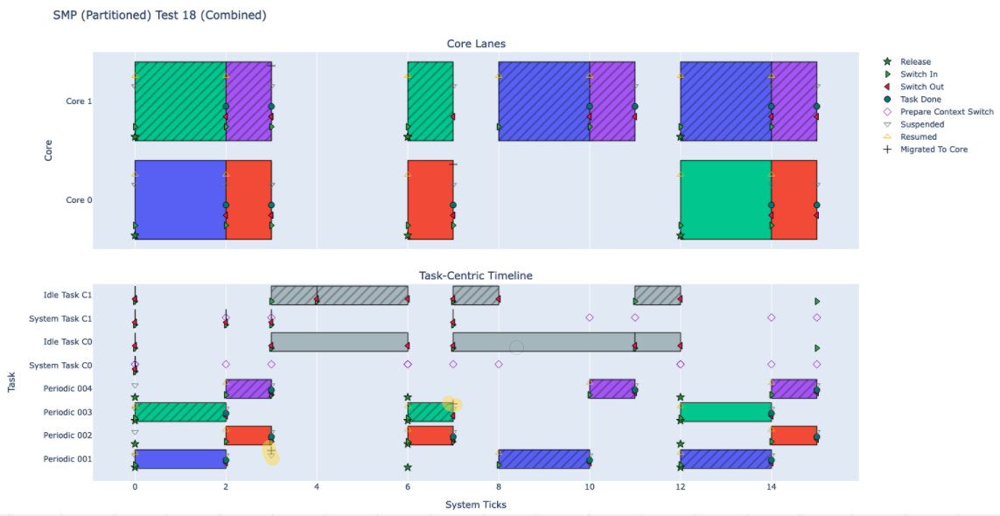

## Test 19 - Migration rejection due to unschedulability

Tests migration admission control. A task migration request to a destination core is rejected because the destination would become unschedulable if the migration were accepted. Verifies that migration respects per-core admission control and doesn't accept requests that would violate deadlines.

Initial tasks:
| Task | Ci| Ti| Di| Core |
| :---: | :---: | :---: | :---: | :--- |
| τcandidate | 2 | 10 | 10 | Core 0 |
| τbaseline. | 1 | 10 | 10 | Core 0 |
| τheavy | 9 | 10 | 10 | Core 1 |

Migration at t=3: Attempts to migrate core 0 task to core 1 (rejected due to core 1 becoming unschedulable)

Validates that migration admission control prevents unschedulable state transitions.

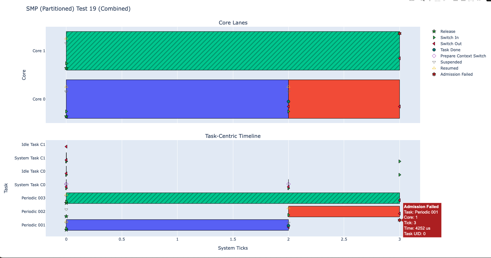

# Global Scheduling

## Test 1 - Global Scheduling (1 Single Task, No Core Migration)

_Simple smoke test showing that a single task can run in global scheduling_

|        Task        | Ci | ri | Di | Ti |
| :----------------: | :-----------: | :-----------: | :-----------: | :-----------: |
| $\tau$1 |       2       |       0       |       4       |       4       |

**Expected**

A single periodic task runs on a single core with a period of 4 and execution time of 2. We see this below.

**Actual**

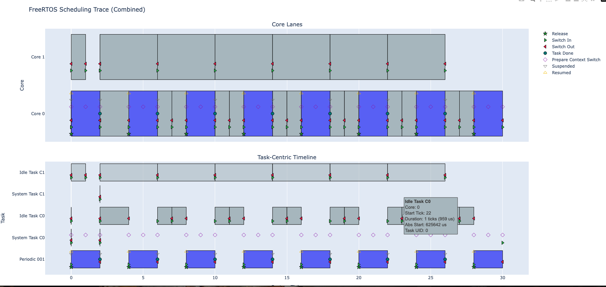

## Test 2 - Global Scheduling (2 Periodic Task, No Core Migration)

_Simple smoke test where global scheduling behaves like partitioned scheduling_

|        Task        | Ci | ri | Di | Ti |
| :----------------: | :-----------: | :-----------: | :-----------: | :-----------: |
| $\tau$1 |       2       |       0       |       4       |       4       |
| $\tau$2 |       3       |       0       |       4       |       4       |

**Expected**

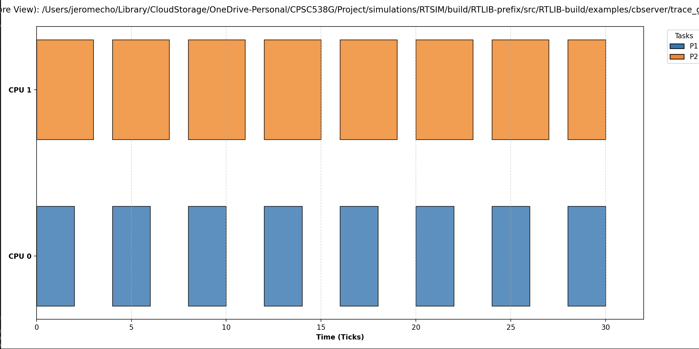

**Actual**

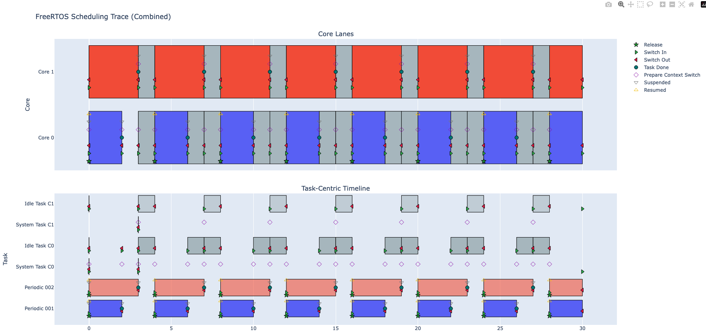

## Test 3 - Global Scheduling (3 Periodic Tasks, Core Migration, One Setup)

_This test tests the ability of the system to support job migration between cores._

|        Task        | Ci | ri | Di | Ti |
| :----------------: | :-----------: | :-----------: | :-----------: | :-----------: |
| $\tau$1 |       2       |       0       |       4       |       4       |
| $\tau$2 |      10       |       0       |      20       |      20       |
| $\tau$3 |      10       |       0       |      20       |      20       |

**Expected**

We used the verifier to check correctness and sanity-checked the plotted trace manually.

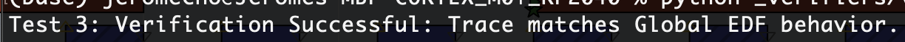

**Actual**

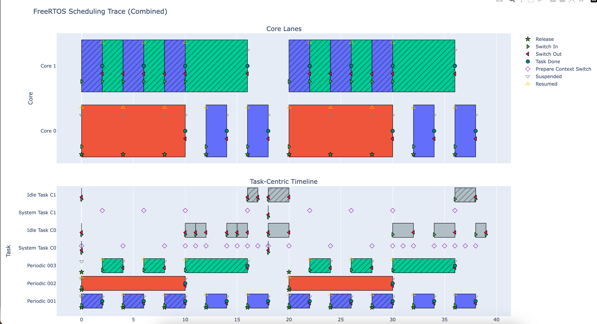

## Test 4 - Global Scheduling (3 Periodic Tasks, Core Migration, Another Setup)

_Another global scheduling example with job migration between cores._

|        Task        | Ci | ri | Di | Ti |
| :----------------: | :-----------: | :-----------: | :-----------: | :-----------: |
| $\tau$1 |       2       |       0       |       4       |       4       |
| $\tau$2 |       1       |       0       |       5       |       5       |
| $\tau$3 |       5       |       0       |      10       |      10       |

**Expected**

We used the verifier to check correctness and sanity-checked the plotted trace manually.

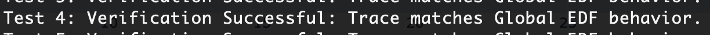

**Actual**

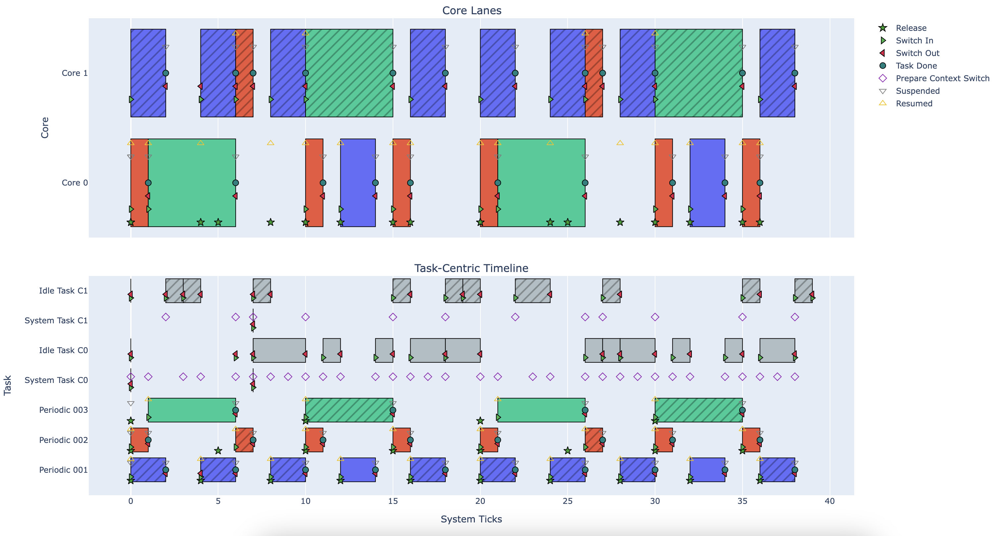

## Test 5 - Global Scheduling (3 Periodic Tasks, Core Migration, Setup wth Large Hyperperiod)

_This tests multiple job and test migrations across cores in a relatively short period of time. With some jobs only running for 1 tick before being pre-empted or being forced to migrate, this test stress tests the global EDF scheduler for off-by-one errors and migration errors._

|        Task        | Ci | ri | Di | Ti |
| :----------------: | :-----------: | :-----------: | :-----------: | :-----------: |
| $\tau$1 |       2       |       0       |       4       |       4       |
| $\tau$2 |       3       |       0       |       7       |       7       |
| $\tau$3 |       3       |       0       |       5       |       5       |

**Expected**

We used the verifier to check correctness and sanity-checked the plotted trace manually.

**Actual**
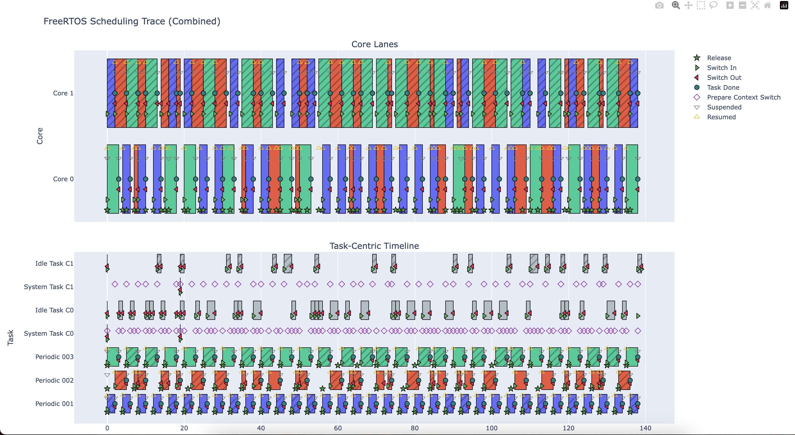

## Test 6 - Admission Failure - Implicit Deadline, Unschedulable (Total Utilization)

This implicit-deadline task set is intentionally unschedulable in global EDF due to aggregate load.
The goal is to confirm admission control rejects the set when total utilization pressure is too high.

|        Task        | Ci | ri | Di | Ti |
| :----------------: | :-----------: | :-----------: | :-----------: | :-----------: |
| $\tau$1 |       8       |       0       |      10       |      10       |
| $\tau$2 |       8       |       0       |      10       |      10       |
| $\tau$3 |       6       |       0       |      10       |      10       |

**Expected**

Admission should fail during task creation, and the trace should show rejection behavior rather than steady periodic execution.

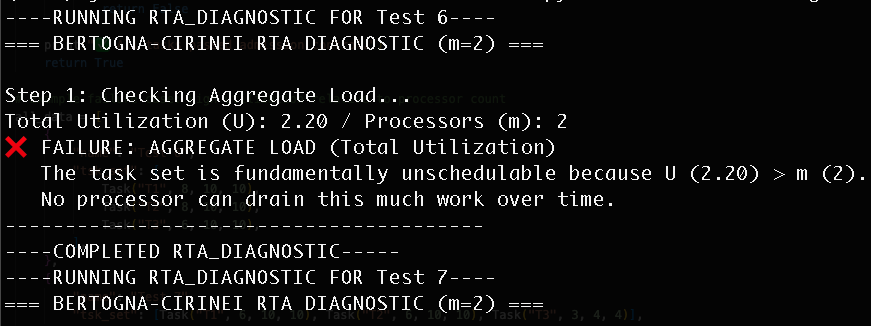

**Actual**

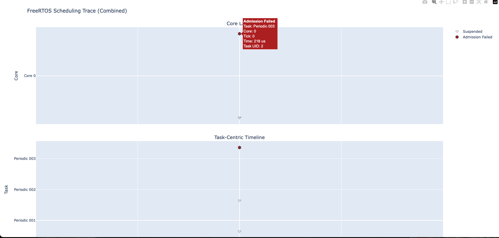

## Test 7 - Admission Failure - Implicit Deadline, Unschedulable (Interference)

This implicit-deadline set stresses interference effects across simultaneously ready tasks.
Even if utilization is not the only obvious factor, interference should make the set unschedulable.

|        Task        | Ci | ri | Di | Ti |
| :----------------: | :-----------: | :-----------: | :-----------: | :-----------: |
| $\tau$1 |       6       |       0       |      10       |      10       |
| $\tau$2 |       6       |       0       |      10       |      10       |
| $\tau$3 |       3       |       0       |       4       |       4       |

**Expected**

Admission should fail due to interference-driven demand, with the failing task rejected.

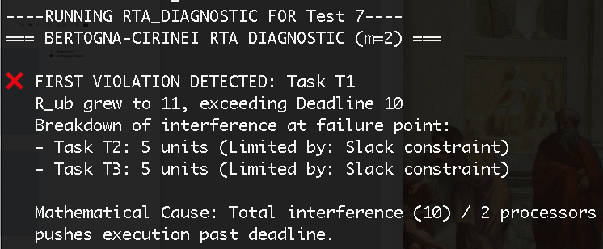

**Actual**

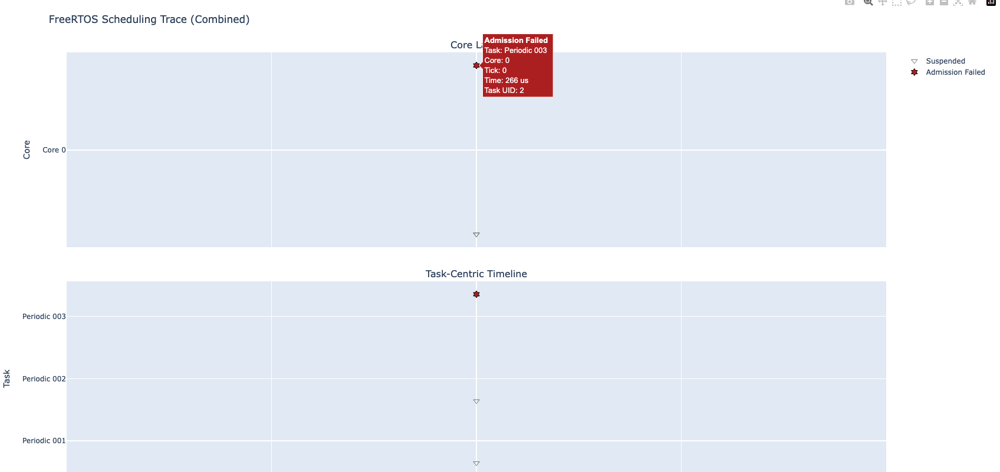

## Test 8 - Admission Failure - Implicit Deadline, Schedulable, But Rejected (Interference)

This implicit-deadline set is included as a conservatism regression test.
It is intended to be theoretically schedulable (for example, this task set runs without deadline misses if we disable admission control), but rejected by the current interference-based admission check.

|        Task        | Ci | ri | Di | Ti |
| :----------------: | :-----------: | :-----------: | :-----------: | :-----------: |
| $\tau$1 |       5       |       0       |      10       |      10       |
| $\tau$2 |       5       |       0       |      10       |      10       |
| $\tau$3 |       4       |       0       |       5       |       5       |

**Expected**

Admission is expected to fail in the current implementation, documenting conservative rejection behavior.

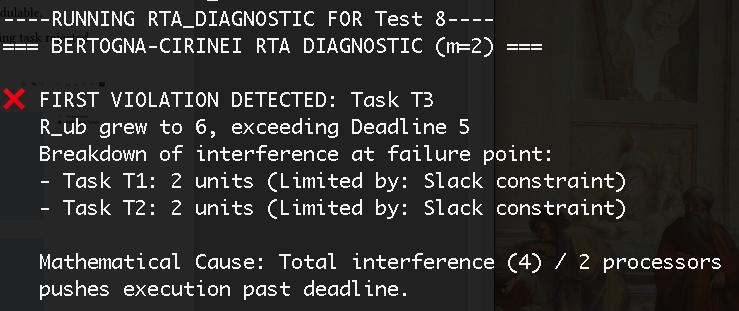

**Actual**

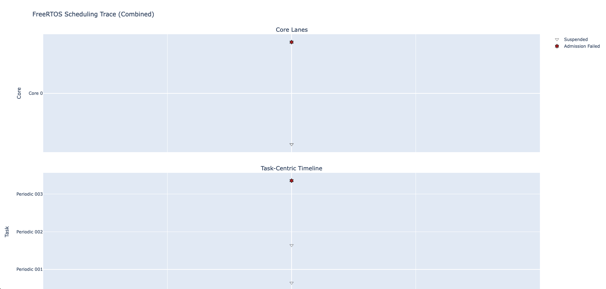

## Test 9 - Admission Failure - Constrained Deadline, Unschedulable (Total Utilization)

This constrained-deadline set is unschedulable under global EDF due to total utilization load with tighter deadlines.
It validates rejection when constrained deadlines cause increased processor demand.

|        Task        | Ci | ri | Di | Ti |
| :----------------: | :-----------: | :-----------: | :-----------: | :-----------: |
| $\tau$1 |       6       |       0       |       8       |      10       |
| $\tau$2 |       8       |       0       |       9       |      10       |
| $\tau$3 |       7       |       0       |       8       |      10       |

**Expected**

Admission should fail during task creation, with no sustained valid schedule produced.

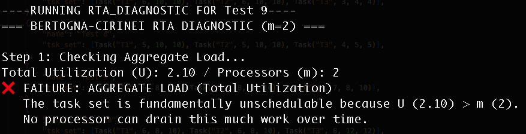

**Actual**

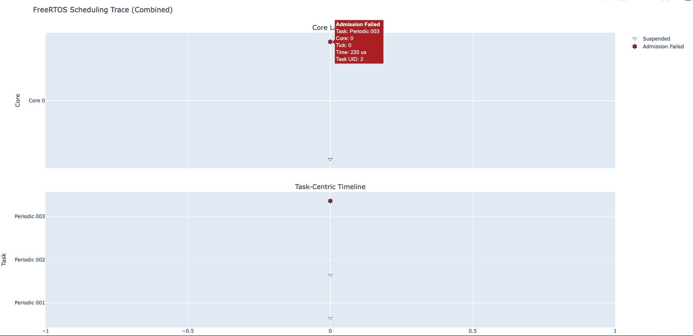

## Test 10 - Admission Failure - Constrained Deadline, Unschedulable (Interference)

This constrained-deadline set targets interference-driven unschedulability.
The test verifies that admission fails under tighter deadlines and higher overlap pressure.

|        Task        | Ci | ri | Di | Ti |
| :----------------: | :-----------: | :-----------: | :-----------: | :-----------: |
| $\tau$1 |       6       |       0       |       8       |      10       |
| $\tau$2 |       6       |       0       |       8       |      10       |
| $\tau$3 |       3       |       0       |       3       |      10       |

**Expected**

Admission should fail because interference under constrained deadlines exceeds admissible bounds.

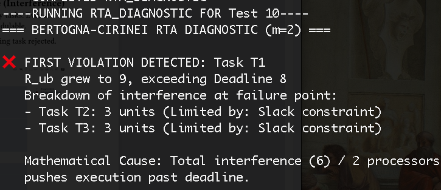

**Actual**

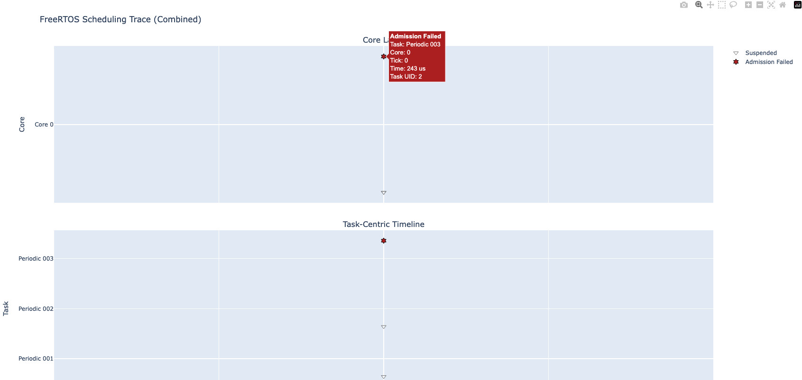

## Test 11 - Admission Failure - Constrained Deadline, Schedulable, But Rejected (Interference)

This constrained-deadline scenario is another conservative regression test.
It is intended to be schedulable in theory (for example, disabling admission control runs the below task set without deadline misses), but currently rejected by conservative interference accounting.

|        Task        | Ci | ri | Di | Ti |
| :----------------: | :-----------: | :-----------: | :-----------: | :-----------: |
| $\tau$1 |       3       |       0       |       6       |       8       |
| $\tau$2 |       3       |       0       |       6       |       8       |
| $\tau$3 |       2       |       0       |       3       |      12       |

**Expected**

Admission is expected to fail in the current implementation, and this behavior is tracked intentionally.

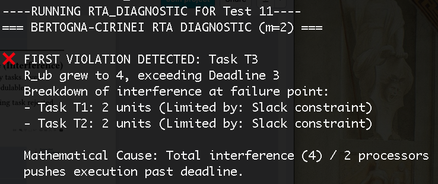

**Actual**

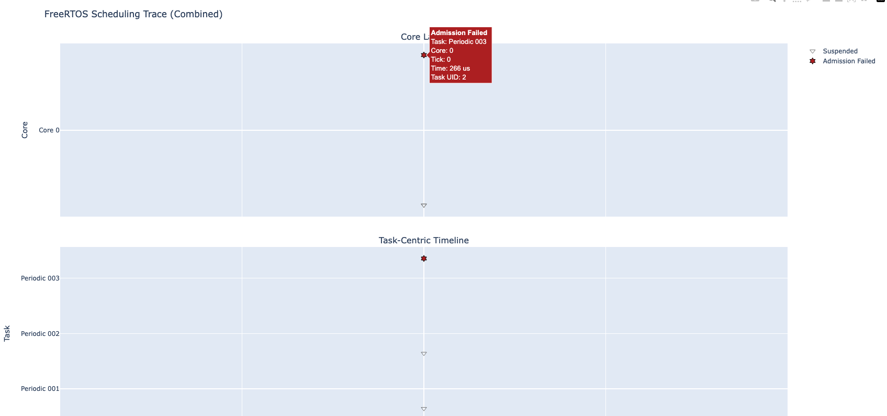

## Test 12 - 100 Tasks ADMISSIBLE

_Tests global scheduler's ability to accept task set with 100 tasks that is admissible_

We create 100 tasks with the below parameters.

|        Task        | Ci | ri | Di | Ti |
| :----------------: | :-----------: | :-----------: | :-----------: | :-----------: |
| $\tau$i |       7       |       0       |     1000      |     1000      |

**Expected**

Scheduler is indeed able to accomodate 100 periodic tasks without crashing and admits the task set successfully as expected.

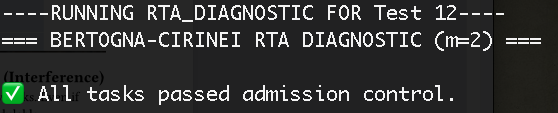

**Actual**

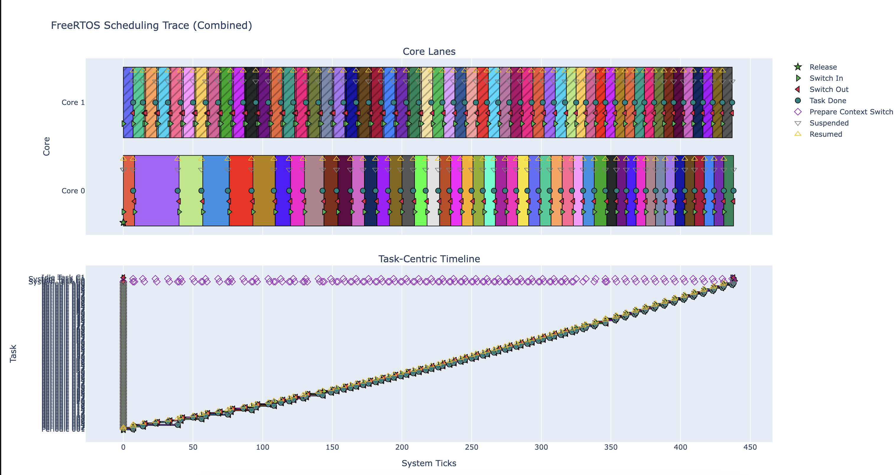

## Test 13 - 100 Tasks NOT-ADMISSIBLE

_Tests global scheduler's ability to reject task set with 100 tasks that is not admissible_

We create 100 tasks with the below parameters.

|        Task        | Ci | ri | Di | Ti |
| :----------------: | :-----------: | :-----------: | :-----------: | :-----------: |
| $\tau$i |      25       |       0       |     1000      |     1000      |

**Expected**

We correctly see an admission failure for a 100-task task set that is not admissible.

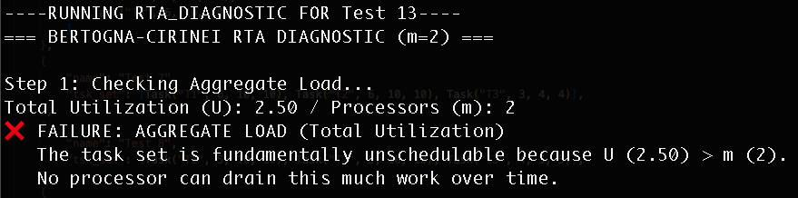

**Actual**

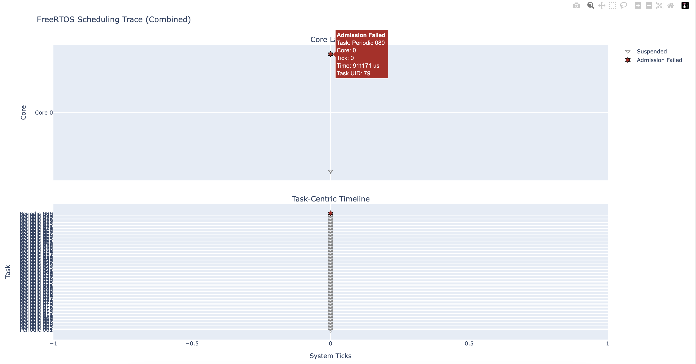

## Test 14 - Drop-In ADMISSIBLE

_Tests ability of global scheduler to accept a task while the system is running_

|        Task        | Ci | ri | Di | Ti |
| :----------------: | :-----------: | :-----------: | :-----------: | :-----------: |
| $\tau$1 |       4       |       0       |       8       |       8       |
| $\tau$2 |       4       |       0       |       8       |       8       |
| $\tau$3 |       4       |      20       |       8       |       8       |

**Expected**

We correctly see the task dropped in while the system is running ("Periodic 003") being scheduled and admitted.

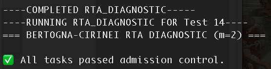

**Actual**

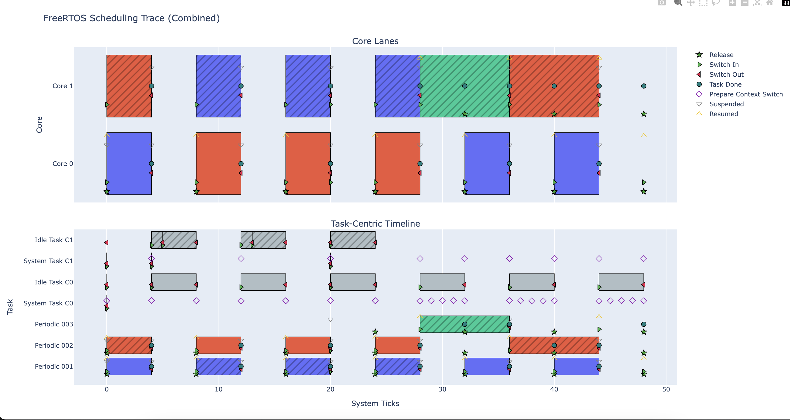

## Test 15 - Drop-In NOT-ADMISSIBLE

_Tests ability of global scheduler to reject a task that would cause the task set to fail admission control while the system is running_

|        Task        | Ci | ri | Di | Ti |
| :----------------: | :-----------: | :-----------: | :-----------: | :-----------: |
| $\tau$1 |       4       |       0       |       8       |       8       |
| $\tau$2 |       4       |       0       |       8       |       8       |
| $\tau$3 |       5       |      20       |       8       |       8       |

**Expected**

We correctly see an admission failure for the dropped in task.

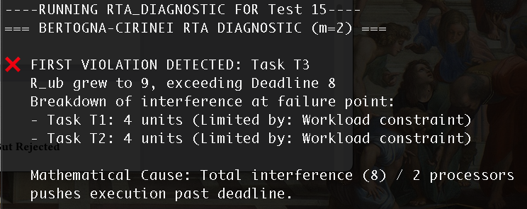

**Actual**

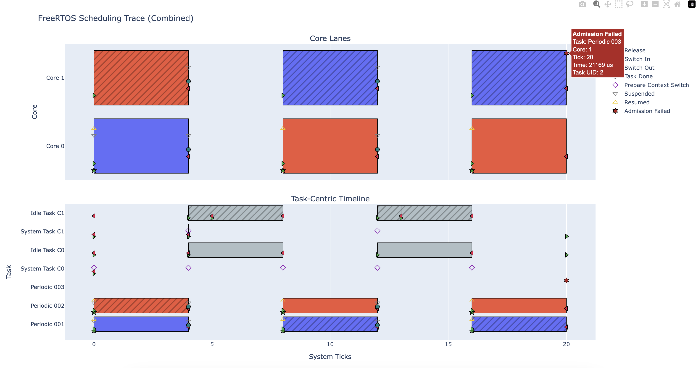
