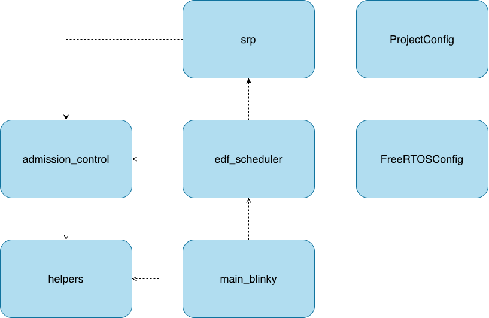
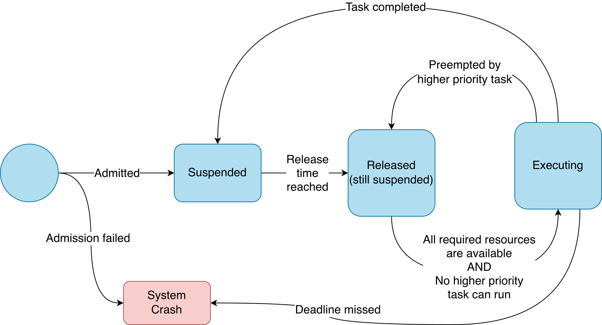
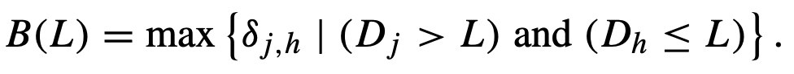
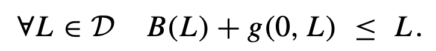
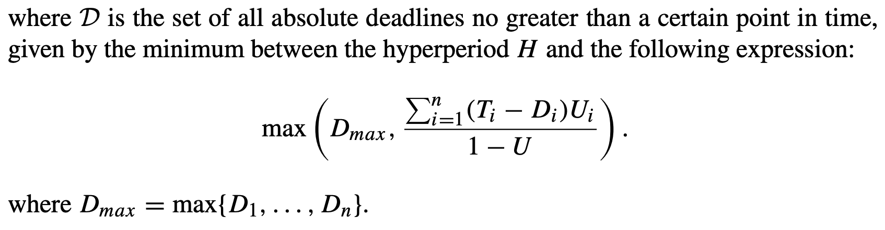

# SRP - Design

Our SRP implementation design description is divided into two parts. First, we provide a high-level system overview of our modules. Then, we dive into the details of how the stack resource policy is implemented.

## System Overview

*Figure 1.1 - System Overview* 

Like with the EDF implementation, `main_blinky` is the main entrypoint to our application. When SRP is enabled, `srp` and `edf_scheduler` in combination contain the API definitions and logic for the scheduling algorithm and resource policy to work. `admission_control` contains all the logic for admitting tasks, while `helpers` serves as a module for generic helper utilities - such as utilities for computing the hyperperiod of a set of tasks. `FreeRTOSConfig` is a configuration file imported by the FreeRTOS kernel `source` and sets up configurations such as tick frequency and FreeRTOS hooks. `ProjectConfig` is a separate configuration file which defines constants and flags only used by our scheduler extension, and not the base FreeRTOS kernel. 

Like with the base EDF implementation, all of these modules are defined as a wrapper layer on top of the FreeRTOS API. 

## SRP Logic

In order to use the SRP features, one has to call SRP-specific functions for creating tasks and acquiring resources (binary semaphores). These features are locked behind a compile-time flag called `SRP_ENABLE` in our `ProjectConfig.h` file, which needs to be set to 1 for the features to become available. 

The main difference between the base EDF implementation and the SRP implementation lies in how preemption is handled. When SRP is enabled, the metadata block (TMB) for each task is extended with information about each task's preemption level, and an array of values representing how long each task will hold a resource. These values are supplied by the user during task creation, exposed as additional arguments in the `SRP_create_task` functions compared to the `EDF_create_task` functions. This additional metadata is used in `edf_scheduler` to determine when tasks can preempt other tasks, and in `admission_control` to determine if a task set will remain schedulable after the introduction of a new task. No check is performed for whether these preemption levels are inversely proportional to the relative deadlines, as is required by SRP. This responsibility currently lies with the user. 

In order for the scheduler to determine preemption, the `srp` module keeps track of the current system ceiling in a stack. A consequence of SRP is that the depth of the system ceiling stack can only ever be as large as the number of different preemption levels among tasks in the system plus the number of resources available, so the stack used by `srp` is kept at this length. A task is only eligible to be scheduled if its preemption level is strictly greater than the current system ceiling, which translates to all resources the task is going to need during its execution being available. A task's state diagram is shown below.

*Figure 1.2 - Task States* 

Additionally, the `srp` module keeps track of all of the resource ceilings. Whenever a task is created, the resource ceilings are updated so that the ceiling for any resource is the maximum preemption level of all tasks that may access it. When a task acquires the resource, the system ceiling is updated to the resource ceiling. Since all resources a specific task requires must be available for it to run, it will never be the case that the system ceiling will be updated to a value lower than what it is at currently. 

## Stack Sharing

A consequence of using SRP is that it enables stack sharing between tasks of the same preemption level. This feature is locked behind a flag called `ENABLE_STACK_SHARING` in `ProjectConfig.h`. To achieve this, the SRP implementation replaces the previous dynamic allocation of tasks (using the `xTaskCreate` API from FreeRTOS) with static allocation (using `xTaskCreateStatic`), such that tasks which should share a stack can simply point to the same pre-allocated slice of memory instead of allocating their own stack at runtime. When stack sharing is disabled, each task will have its own pre-allocated stack. 

Since tasks with the same preemption level will not preempt each other during execution, the only roadblock for our design comes from the fact that periodic tasks in our EDF implementation are "persistent" (suspended rather than deleted). Because of this, the FreeRTOS scheduler will attempt to resume a task from where it left off. When stack sharing is enabled, this might have changed due to another task running. To mitigate this, `SRP_reset_TCB` is called by the scheduler at the start of every new period. This function resets the Task Control Block's internal stack pointer to the base address of the shared stack memory, ensuring the task begins execution with a clean stack frame. 

## Admission Control

Admission control for SRP is implemented by ensuring that for every task in the task set, equation 7.25 holds after the introduction of a new task. This equation uses the notion of "blocking time" and a "blocking function" defined as "the largest amount of time for which a task with relative deadline ≤ L may be blocked by a task with relative deadline > L", and ensures that the task set considers the resource hold times for each task, and not just their utilization and processor demands as for pure EDF. The equations are shown below:

