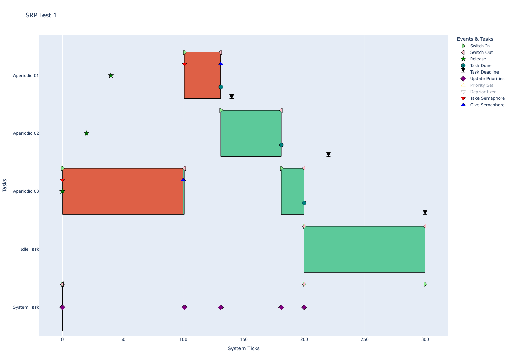
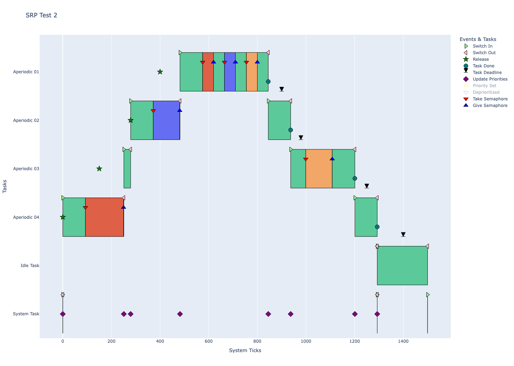
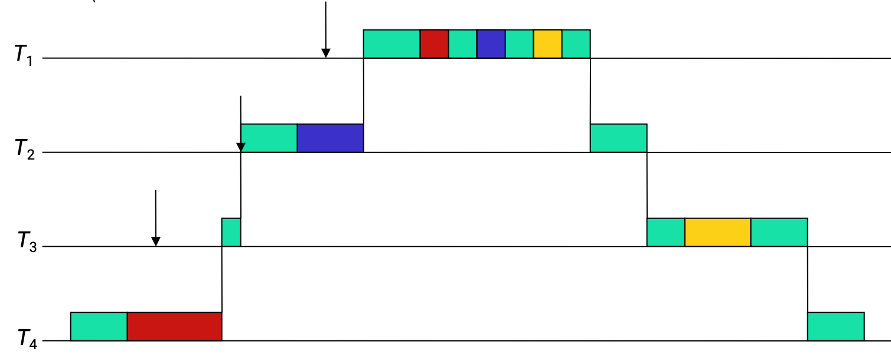
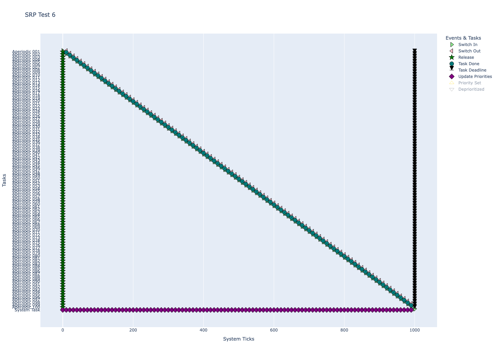
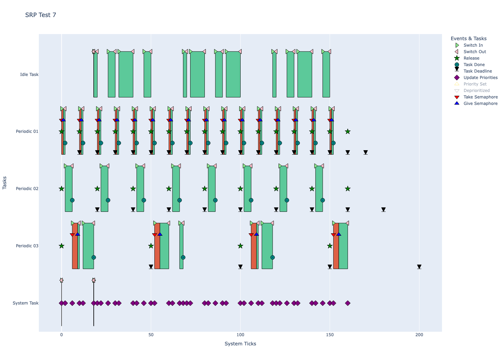

# SRP - Testing

## Overview

A hardware-in-the-loop (HIL) testing framework was implemented for SRP, which greatly improved on the testing methodology compared to what was done for EDF. We no longer require a logic analyzer to verify the results, and instead rely on events (traces) recorded during the test's execution. The traces are printed after a certain amount of time has passed (the "test time"), which is configurable to allow for different tests to run shorter or longer as necessary, and which prevents any bus activity from interfering with the execution of the test and scheduler. The collection of traces is deliberately kept as light-weight as possible, in order to minimize the delay it introduces to the scheduler. 

By transmitting such a log of traces after a test is complete, we are able to more reliably inspect the execution order of events, reproduce exact results and inspect details about the system in a much greater degree than just visually inspecting the time slices for which a given task executes. In addition, the traces allow us to more easily define unit tests for each defined test, allowing us to quickly and easily perform automated regression testing during development. 

To automate the testing as much as possible, we utilize a python script `test_runner.py` which iterates through a list of predefined tests, compiles the program and waits for the microcontroller to be manually put into flash mode. It then flashes the microcontroller, collects the trace output after the test finishes, and verifies that the collected traces match against a predefined list of expected ones. This way it is possible for us to quickly perform regression testing across multiple predefined tests with minimal time and effort. 

In the following document, the notation P<sub>i</sub> is used to denote the preemption level of a given task. Each task is also defined with a list of how long it will hold each resource - e.g. if a task's resource list includes [0, 45] this would mean that it will hold resource 0 for 0 ticks during it's execution, and that it will hold resource 1 for 45 ticks during it's execution. 

## Test 1 - Simple Single-Resource SRP Validation

This test demonstrates how SRP prevents a medium-priority task from preempting a low-priority task holding a shared resource. 

For test 1, the (aperiodic) task set was defined as follows:
| Task | C<sub>i</sub> | r<sub>i</sub> | D<sub>i</sub> | P<sub>i</sub> | Resources |
| :---: | :---: | :---: | :---: | :---: | :--- |
| τ<sub>1</sub> | 30 | 40 | 100 | 3 | 30 |
| τ<sub>2</sub> | 50 | 20 | 200 | 2 | 0 |
| τ<sub>3</sub> | 120 | 0 | 300 | 1 | 100 |

As is shown in the image below, the SRP works flawlessly for this task set. 



## Test 2 - Complex Multi-Resource SRP Validation

The second test uses 4 tasks and 3 distinct resources (semaphores) to validate nested resource locking and system ceiling dynamic updates. The specific task set is taken from:
https://cpen432.github.io/resources/bader-slides/8-ResourceSharing.pdf, Page 49

| Task | C<sub>i</sub> | r<sub>i</sub> | D<sub>i</sub> | P<sub>i</sub> | Resources |
| :---: | :---: | :---: | :---: | :---: | :--- |
| τ<sub>1</sub> | 363 | 400 | 500  | 4 | 45,45,45 |
| τ<sub>2</sub> | 295 | 279 | 700  | 3 | 0,109,0 |
| τ<sub>3</sub> | 292 | 150 | 1100 | 2 | 0,0,109 |
| τ<sub>4</sub> | 343 | 0   | 1400 | 1 | 157,0,0 |

The trace below shows the test working as it should:


It can be compared to the reference implementation if desired:


## Tests 3 & 4 - Stack Sharing (simple execution)

The third and fourth tests show both that the stack sharing works, giving the same traces with stack sharing enabled and distabled, and that stack sharing reduces the stack usage for the program.

The task set given below is run first without stack sharing enabled, and then with it enabled, which shows that test 4 achieves a reduction of 1,024 bytes compared to test 3. 

| Task | C<sub>i</sub> | r<sub>i</sub> | D<sub>i</sub> | P<sub>i</sub> | Resources |
| :---: | :---: | :---: | :---: | :---: | :--- |
| τ<sub>1</sub> | 100 | 0 | 300 | 1 | NULL |
| τ<sub>2</sub> | 100 | 20 | 230 | 1 | NULL |
| τ<sub>3</sub> | 50 | 50 | 150 | 2 | NULL |

```txt
STATUS | ID   | .TEXT    | .DATA | .BSS     | TEST DESCRIPTION
-------------------------------------------------------------------------------------
[PASS] | SRP3 | 59,780 B | 0 B   | 32,360 B | Stack Sharing Disabled
[PASS] | SRP4 | 59,812 B | 0 B   | 31,336 B | Stack Sharing Enabled
```

## Tests 5 & 6 - Stack Sharing (100 Tasks w/ 5 Preemption Levels)

Tests 5 and 6 really show the same results as tests 3 and 4, but for a larger and more complex task set. The test runs with 100 tasks, each of which has the same parameters, except for the preemption level, which there are 5 of, uniformly distributed across the tasks. 

Running the test shows that enabling stack sharing reduces the stack usage of test 6 by 97,280 bytes compared to test 5.

| Task | C<sub>i</sub> | r<sub>i</sub> | D<sub>i</sub> | P<sub>i</sub> | Resources |
| :---: | :---: | :---: | :---: | :---: | :--- |
| τ<sub>i</sub> | 10 | 0 | 250 | (i % 5) + 1 | NULL |

```txt
STATUS | ID   | .TEXT    | .DATA | .BSS      | TEST DESCRIPTION
-------------------------------------------------------------------------------------
[PASS] | SRP5 | 60,412 B | 0 B   | 147,996 B | Stack Sharing Disabled
[PASS] | SRP6 | 60,444 B | 0 B   | 50,716 B  | Stack Sharing Enabled
```



## Test 7 - Admission Control Pass (Implicit Deadlines)

The seventh test shows the admission control in action, using the admission control bound described in equation 7.25 in the course textbook, and which is shown in the design section of this documentation.

The following task-set is defined, which should be admitted into the system, as shown by the calculations below:

```txt
Total Utilization (U): 0.6000
Resource Ceilings: [1]

--- Checking Utilization + Blocking Bounds ---
Task τ1 (D=10): U_sum=0.2000, B_k=0, Load=0.2000 -> OK
Task τ2 (D=20): U_sum=0.4000, B_k=1, Load=0.4500 -> OK
Task τ3 (D=50): U_sum=0.6000, B_k=1, Load=0.6200 -> OK

--- Checking DBF + Blocking (B_L) ---
Checking deadlines up to t = 50

t      | dbf(t)   | B(t)   | Total    | Status
---------------------------------------------
10     | 2        | 3      | 5        | OK
20     | 8        | 3      | 11       | OK
30     | 10       | 3      | 13       | OK
40     | 16       | 3      | 19       | OK
50     | 28       | 0      | 28       | OK
---------------------------------------------
Final Decision: SCHEDULABLE by SRP.
```

| Task | C<sub>i</sub> | T<sub>i</sub> | D<sub>i</sub> | P<sub>i</sub> | Resources |
| :---: | :---: | :---: | :---: | :---: | :--- |
| τ<sub>1</sub> | 2 | 10 | 10 | 3 | 1 |
| τ<sub>2</sub> | 4 | 20 | 20 | 2 | 0 |
| τ<sub>3</sub> | 10 | 50 | 50 | 1 | 3 |

The system successfully admits the task-set, as is shown in the image below:


## Test 8 - Admission Control Fail (Implicit Deadlines)

Test 8 is identical to test 7, with the exception that task 3 holds the shared resource far longer. This causes the blocking factor to increase, causing the admission control to fail.

| Task | C<sub>i</sub> | T<sub>i</sub> | D<sub>i</sub> | P<sub>i</sub> | Resources |
| :---: | :---: | :---: | :---: | :---: | :--- |
| τ<sub>1</sub> | 2 | 10 | 10 | 3 | 1 |
| τ<sub>2</sub> | 4 | 20 | 20 | 2 | 0 |
| τ<sub>3</sub> | 10 | 50 | 50 | 1 | 9 |

```txt
Total Utilization (U): 0.6000
Resource Ceilings: [1]

--- Checking Utilization + Blocking Bounds ---
Task τ1 (D=10): U_sum=0.2000, B_k=0, Load=0.2000 -> OK
Task τ2 (D=20): U_sum=0.4000, B_k=1, Load=0.4500 -> OK
Task τ3 (D=50): U_sum=0.6000, B_k=1, Load=0.6200 -> OK

--- Checking DBF + Blocking (B_L) ---
Checking deadlines up to t = 50

t      | dbf(t)   | B(t)   | Total    | Status
---------------------------------------------
10     | 2        | 9      | 11       | FAIL
20     | 8        | 9      | 17       | OK
30     | 10       | 9      | 19       | OK
40     | 16       | 9      | 25       | OK
50     | 28       | 0      | 28       | OK
---------------------------------------------
Final Decision: REJECTED by SRP DBF check.
```

The scheduler correctly denies admission in this case:

```txt
[Monitor] Connected to Pico!
Starting main_blinky.
Running SRP Test 8
SRP_create_periodic_task - Admission failed for: SRP Test 8, Task 3
```

## Test 9 - Admission Control Fail (Constrained Deadlines)

The last test for SRP verifies the admission control logic for task-sets with constrained deadlines. 

The following task-set should not be schedulable.

| Task | C<sub>i</sub> | T<sub>i</sub> | D<sub>i</sub> | P<sub>i</sub> | Resources |
| :---: | :---: | :---: | :---: | :---: | :--- |
| τ<sub>1</sub> | 5 | 20 | 10 | 3 | 2 |
| τ<sub>2</sub> | 4 | 20 | 12 | 2 | 0 |
| τ<sub>3</sub> | 8 | 50 | 50 | 1 | 6 |

```txt
Total Utilization (U): 0.6100
Resource Ceilings: [1]

--- Checking Utilization + Blocking Bounds ---
Task τ1 (D=10): U_sum=0.2500, B_k=0, Load=0.2500 -> OK
Task τ2 (D=12): U_sum=0.4500, B_k=2, Load=0.5500 -> OK
Task τ3 (D=50): U_sum=0.6100, B_k=2, Load=0.6500 -> OK

--- Checking DBF + Blocking (B_L) ---
Checking deadlines up to t = 50

t      | dbf(t)   | B(t)   | Total    | Status
---------------------------------------------
10     | 5        | 6      | 11       | FAIL
12     | 9        | 6      | 15       | FAIL
30     | 14       | 6      | 20       | OK
32     | 18       | 6      | 24       | OK
50     | 31       | 0      | 31       | OK
---------------------------------------------
Final Decision: REJECTED by SRP DBF check.
```

The scheduler correctly denies admission in this case:

```txt
[Monitor] Connected to Pico!
Starting main_blinky.
Running SRP Test 9
SRP_create_periodic_task - Admission failed for: SRP Test 9, Task 3
```
